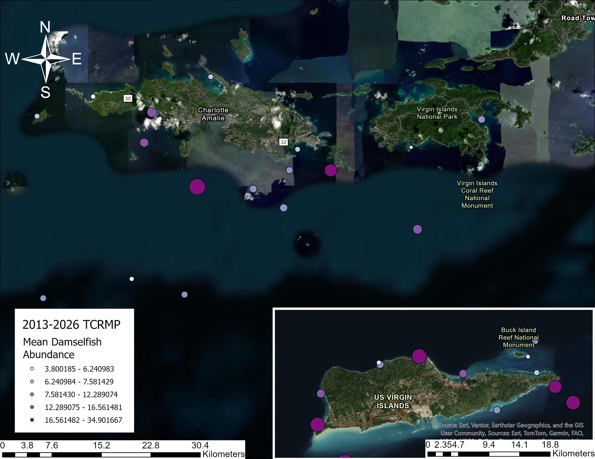
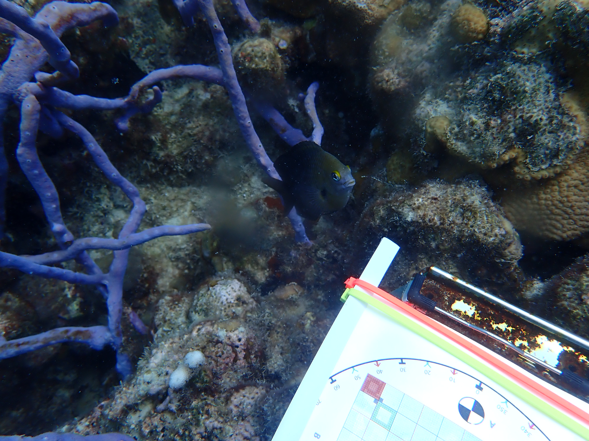

## Damselfish Population Trends from 2013-2021

The Territorial Coral Reef Monitoring Program (TCRMP) has fish abundance and biomass data from 2002; however, records of damselfish-coral interactions do not consistently begin until 2013 which is why I am looking at trends from 2013-2021.

All damselfish species found in the USVI were accounted for measuring the biomass and abundance at each TCRMP site. Two maps were created to look at the mean damselfish biomass/ abundance rom 2013 to 2021 (Figure No.1 and No.2). From the maps, it looks like St. Croix has a higher abundance of damselfish species throughout the years, but have medium biomass.



```{r}
####Libraries########
library(tidyverse)
library(readxl)
library(ggplot2)

#GOAL: average damselfish abundance for every site for the last 10 years 

TCRMP_FISH_METADATA <- read.csv("TCRMP_datasets/TCRMP_FISH/AUG2022/TCRMP_Master_Fish_Census_Aug2022.xlsx - MetaData.csv")

TCRMP_FISH_RAW <- read.csv("TCRMP_datasets/TCRMP_FISH/AUG2022/TCRMP_Master_Fish_Census_Aug2022.xlsx - FishData.csv") # TCRMP FISH data

CLEAN_TCRMP_FISH <- subset(TCRMP_FISH_RAW, select = -c(Month, SampleYear , Period, CommonName, X0.5, X6.10, X11.20, X21.30, X31.40, X41.50, X51.60, X61.70, X71.80, X81.90, X91.100)) %>% # removing excess columns 
  mutate(Location = toupper(Location)) %>% #making all site names the same 
  dplyr::filter(!dplyr::between(as.numeric (Year), 2003, 2012)) #filter data to 2013-2021 %>%


ABUND_DAMSEL <- dplyr::filter(CLEAN_TCRMP_FISH, Metric!= "Biomass" , # removing rows (biomass)
                              ScientificName %in% c(
                                "Microspathodon chrysurus",
                                "Stegastes partitus",
                                "Stegastes variabilis",
                                "Stegastes adustus",
                                "Stegastes leucostictus",
                                "Stegastes planifrons"
                              ))
#############################################################################################################################################################
TRANSECT_ABUNDANCE_MEAN_DAMSELFISH <- ABUND_DAMSEL %>% # mean of damselfish abundance along each transect by year and location
  group_by(Location, Transect, Year) %>% 
  summarise(
    Sum_Abundance= sum(Total),
    Mean_Abundance  = mean(Total) ,
    .groups = "drop") %>% 
  unique()

ABUNDANCE_DAMSELFISH <- TRANSECT_ABUNDANCE_MEAN_DAMSELFISH  %>% # Mean of damselfish abundance along each site per year and location
  group_by(Location, Year)  %>% 
  summarise(
    Location_Abundance_mean = (sum(Mean_Abundance))/10 #10 is the transect per site
  )

MAP_ABUND_DAMSELFISH <- ABUNDANCE_DAMSELFISH  %>% # Mean of damselfish biomass along each site 
  group_by(Location)  %>% 
  summarise(
    Location_Abundance_mean = (mean(Location_Abundance_mean))
  )

# print(head(MAP_ABUND_DAMSELFISH)) # map stuff
##############################################################################################################################################################


############# St. Thomas ############################
STT_ADAMS <- dplyr::filter(ABUND_DAMSEL, #Only including St. Thomas sites
                           Location %in% c(
                               "BLACK POINT",
                               "BREWERS BAY",
                               "FLAT CAY",
                               "BUCK ISLAND STT",
                               "SOUTH WATER",
                               "SOUTH CAPELLA",
                               "SEAHORSE COTTAGE SHOAL",
                               "ST JAMES",
                               "COCULUS ROCK",
                               "MAGENS BAY",
                               "BOTANY BAY",
                               "SAVANA",
                               "GRAMMANIK TIGER FSA",
                               "COLLEGE SHOAL EAST",
                               "GINGSBURG FRINGE"
                             ))

STT_TAMD <- STT_ADAMS %>% # mean of damselfish abundance along each transect by year and location
  group_by(Location, Transect, Year) %>% 
  summarise(
    Sum_Abundance= sum(Total),
    Mean_Abundance  = mean(Total) ,
    .groups = "drop") %>% 
  unique()

STT_ABUNDANCE_DAMSELFISH <- STT_TAMD  %>% # Mean of damselfish abundance along each site per year and location
  group_by(Location, Year)  %>% 
  summarise(
    Location_Abundance_mean = (sum(Mean_Abundance))/10 #10 is the transect per site
  )

STT_ABUNDANCE_PLOT <- ggplot(STT_ABUNDANCE_DAMSELFISH, aes(x=Year , y = Location_Abundance_mean, group= Location, color = Location)) +  # damselfish abundance from 2013-2022 on St Thomas
  geom_line() +
  scale_x_continuous(breaks = seq(min(STT_ABUNDANCE_DAMSELFISH$Year), max(STT_ABUNDANCE_DAMSELFISH$Year), by = 1)) +
  labs(x= "Year", y= "Mean Abundance") +
  labs(caption = "Figure No. 4. Average Damselfish Abundance Per Year By Location") +
  theme_minimal() +
  theme(legend.position = "right") +
  theme(axis.text.x = element_text(angle = 45, hjust = 1)) 

################# St. Croix #####################

SX_ADAMS <- dplyr::filter(ABUND_DAMSEL, #Only including St. Thomas sites
                          Location %in% c(
                            "BUCK ISLAND STX",
                            "BUCK ISLAND STX DEEP",
                            "LANG BANK EEMP",
                            "HIND BANK EAST FSA",
                            "JACKS BAY",
                            "CASTLE",
                            "GREAT POND",
                            "LANG BANK RED HIND FSA",
                            "MUTTON SNAPPER FSA",
                            "KINGS CORNER",
                            "CANE BAY",
                            "SALT RIVER",
                            "EAGLE RAY"
                          ))

STX_TAMD <- SX_ADAMS %>% # mean of damselfish abundance along each transect by year and location
  group_by(Location, Transect, Year) %>% 
  summarise(
    Sum_Abundance= sum(Total),
    Mean_Abundance  = mean(Total) ,
    .groups = "drop") %>% 
  unique()

STX_ABUNDANCE_DAMSELFISH <- STX_TAMD  %>% # Mean of damselfish abundance along each site per year and location
  group_by(Location, Year)  %>% 
  summarise(
    Location_Abundance_mean = (sum(Mean_Abundance))/10 #10 is the transect per site
  )

STX_ABUNDANCE_PLOT <- ggplot(STX_ABUNDANCE_DAMSELFISH, aes(x=Year , y = Location_Abundance_mean, group= Location, color = Location)) + 
  geom_line() +
  scale_x_continuous(breaks = seq(min(STX_ABUNDANCE_DAMSELFISH$Year), max(STX_ABUNDANCE_DAMSELFISH$Year), by = 1)) + # damselfish abundance from 2013-2022 on St Croix 
  labs(x= "Year", y= "Mean Abundance") +
  labs(caption = "Figure No. 4. Average Damselfish Abundance Per Year By Location") +
  theme_minimal() +
  theme(legend.position = "right") +
  theme(axis.text.x = element_text(angle = 45, hjust = 1)) 

############## ST. JOHN ######################

SJ_ADAMS <- dplyr::filter(ABUND_DAMSEL, #Only including St. Thomas sites
                          Location %in% c(
                            "MERI SHOAL",
                            "FISH BAY",
                            "CORAL BAY"
                          ))


STJ_TAMD <- SJ_ADAMS %>% # mean of damselfish abundance along each transect by year and location
  group_by(Location, Transect, Year) %>% 
  summarise(
    Sum_Abundance= sum(Total),
    Mean_Abundance  = mean(Total) ,
    .groups = "drop") %>% 
  unique()

STJ_ABUNDANCE_DAMSELFISH <- STJ_TAMD  %>% # Mean of damselfish abundance along each site per year and location
  group_by(Location, Year)  %>% 
  summarise(
    Location_Abundance_mean = (sum(Mean_Abundance))/10 #10 is the transect per site
  )

STJ_ABUNDANCE_PLOT <- ggplot(STJ_ABUNDANCE_DAMSELFISH, aes(x=Year , y = Location_Abundance_mean, group= Location, color = Location)) + 
  geom_line() + # damselfish abundance from 2013-2022 on St John
  scale_x_continuous(breaks = seq(min(STJ_ABUNDANCE_DAMSELFISH$Year), max(STJ_ABUNDANCE_DAMSELFISH$Year), by = 1)) +
  labs(x= "Year", y= "Mean Abundance") +
  labs(caption = "Figure No. 4. Average Damselfish Abundance Per Year By Location") +
  theme_minimal() +
  theme(legend.position = "right") +
  theme(axis.text.x = element_text(angle = 45, hjust = 1)) 

```

```{r}
STT_ALL_ABUNDANCE_DAMSELFISH <- STT_ABUNDANCE_DAMSELFISH  %>% # Mean of damselfish abundance on St. Thomas from 2013-2021
  group_by(Year)  %>% 
  summarise(
    Abundance_mean = (mean(Location_Abundance_mean))
  )

STT_ALL_ABUNDANCE_DAMSELFISH_PLOT <- ggplot(STT_ALL_ABUNDANCE_DAMSELFISH, aes(x = Year , y = Abundance_mean)) + 
  geom_line() + # damselfish abundance from 2013-2022 on St Thomas 
  scale_x_continuous(breaks = seq(min(STT_ALL_ABUNDANCE_DAMSELFISH$Year), max(STT_ALL_ABUNDANCE_DAMSELFISH$Year), by = 1)) + 
  labs(x= "Year", y= "Mean Abundance") +
  labs(caption = "Figure No. 4. St. Thomas Average Damselfish Abundance Per Year") +
  theme_minimal() +
  theme(legend.position = "right") +
  theme(axis.text.x = element_text(angle = 45, hjust = 1)) 

################ ST. CROIX ###################

STX_ALL_ABUNDANCE_DAMSELFISH <- STX_ABUNDANCE_DAMSELFISH  %>% # Mean of damselfish abundance on St. Croix from 2013-2021
  group_by(Year)  %>% 
  summarise(
    Abundance_mean = (mean(Location_Abundance_mean))
  )

STX_ALL_ABUNDANCE_DAMSELFISH_PLOT <- ggplot(STX_ALL_ABUNDANCE_DAMSELFISH, aes(x = Year , y = Abundance_mean)) + 
  geom_line() + # damselfish abundance from 2013-2022 on St Croix 
  scale_x_continuous(breaks = seq(min(STX_ALL_ABUNDANCE_DAMSELFISH$Year), max(STX_ALL_ABUNDANCE_DAMSELFISH$Year), by = 1)) + 
  labs(x= "Year", y= "Mean Abundance") +
  labs(caption = "Figure No. 4. St. Thomas Average Damselfish Abundance Per Year") +
  theme_minimal() +
  theme(legend.position = "right") +
  theme(axis.text.x = element_text(angle = 45, hjust = 1)) 

################# ST. JOHN #########################

STJ_ALL_ABUNDANCE_DAMSELFISH <- STJ_ABUNDANCE_DAMSELFISH  %>% # Mean of damselfish abundance on St. John from 2013-2021
  group_by(Year)  %>% 
  summarise(
    Abundance_mean = (mean(Location_Abundance_mean))
  )

STJ_ALL_ABUNDANCE_DAMSELFISH_PLOT <- ggplot(STJ_ALL_ABUNDANCE_DAMSELFISH, aes(x = Year , y = Abundance_mean)) + 
  geom_line() + # damselfish abundance from 2013-2022 on St John 
  scale_x_continuous(breaks = seq(min(STJ_ALL_ABUNDANCE_DAMSELFISH$Year), max(STJ_ALL_ABUNDANCE_DAMSELFISH$Year), by = 1)) + 
  labs(x= "Year", y= "Mean Abundance") +
  labs(caption = "Figure No. 4. St. Thomas Average Damselfish Abundance Per Year") +
  theme_minimal() +
  theme(legend.position = "right") +
  theme(axis.text.x = element_text(angle = 45, hjust = 1)) 

######### MERGING THEM TOGETHER ############

##adding columns of site to each dataset

STT_ALL_ABUNDANCE_DAMSELFISH$Site <- "St. Thomas"
STX_ALL_ABUNDANCE_DAMSELFISH$Site <- "St. Croix"
STJ_ALL_ABUNDANCE_DAMSELFISH$Site <- "St. John"


USVI_ABUNDANCE <- bind_rows(STT_ALL_ABUNDANCE_DAMSELFISH ,
  STJ_ALL_ABUNDANCE_DAMSELFISH, 
  STX_ALL_ABUNDANCE_DAMSELFISH)

USVI_ABUNDANCE_PLOT <- ggplot(USVI_ABUNDANCE, aes(x = Year , y = Abundance_mean, group = Site , color = Site)) + 
  geom_line() + # damselfish abundance from 2013-2022 on USVI
  scale_x_continuous(breaks = seq(min(USVI_ABUNDANCE$Year), max(USVI_ABUNDANCE$Year), by = 1)) + 
  labs(x= "Year", y= "Mean Abundance") +
  labs(caption = "Figure No. 4. USVI Average Damselfish Abundance Per Year") +
  theme_minimal() +
  theme(legend.position = "right") +
  theme(axis.text.x = element_text(angle = 45, hjust = 1)) 
print(USVI_ABUNDANCE_PLOT)

```

::: panel-tabset
## St. Thomas

```{r}
print(STT_ABUNDANCE_PLOT) # St. Thomas Damselfish Abundance 2013-2022 
```

## St. John

```{r}
print(STJ_ABUNDANCE_PLOT) # St. John Damselfish Abundance 2013-2022
```

## St. Croix

```{r}
print(STX_ABUNDANCE_PLOT) # St. Croix Damselfish Abundance 2013-2022
```
:::

```{r}
TCRMP_SITE <- read.csv("C:/Users/Owner/OneDrive/Documents/GOODMAN_THESIS/TCRMP_datasets/TCRMP_Site_Metadata.xls - SiteMetadata.csv") %>% 
  mutate(Location = toupper(Location))  #MERGING TCRMP SITE WITH CORAL

CORAL_HEALTH_RAW <- read.csv("TCRMP_datasets/TCRMP_CORAL_HEALTH/JUNE2022/TCRMP_Master_Coral_Health_Jan2022.xlsx - HealthDataRaw.csv") ## RAW TCRMP CORAL DATA

#each row describes a location of a singular coral along a transect (6 Transects per site). This coral is identified by its species, LWH, bleaching, mortality, Algal interactions, sponge interactions, and predation) 

#I need to separate the data by site, per year. I want to look at different coral species and which ones have more damselfish presence. 
# I need year, site, annual (?), transect, species, LWH, mortality, bleaching, damselfish pres, bites, lesion, lesion pattern(?). 

unique(CORAL_HEALTH_RAW$SampleYear)

CORAL_HEALTH_CLEAN <- subset(CORAL_HEALTH_RAW, select = c(Location, SampleYear, Period, Transect, SPP, Length, Width, Height, Dict, Lobo, Hali,DamSpp, Notes, BL, P, VP, SP, OldMort, RecMort, Pred1, Pred1ID, Pred2, Pred2ID))  %>% 
dplyr::filter(!dplyr::between(as.numeric (as.character(SampleYear)), 2002, 2012)) #filter data to 2013-2021

### The species that have been recorded are: 
      #Damselfish species (unknown) 
      #Microspathodon chrysurus        #Yellowtail damselfish
      #Stegastes partitus,               #Bicolor damselfish
      #Stegastes variabilis,             #Cocoa damselfish
      #Stegastes diencaeus,             #Longfin damselfish
      #Stegastes adustus                #Dusky damselfish
      #Stegastes leucostictus,           #Beaugregory damselfish
      #Stegastes planifrons,             #Threespot damselfish

# Now, I wanna look at ALL the corals with damselfish interactions within 2013-2021!! haahahahahah

DAMSONLY <- CORAL_HEALTH_CLEAN  %>% 
  dplyr::filter(DamSpp %in% c("SPLAN", "DFSP" , "SADUS", "SLEUC" ,"MCHRY", "SPARI" ,"SVARI" ,"SDIEN"))
  
# ooh la la ! I want to see the percentages of what damselfish species are present among ALL corals 

#What coral species do damselfish like to party in 

CORALSP <- ggplot( DAMSONLY, aes(x = SPP , fill = DamSpp)) +
  geom_bar() +
  labs(x = "Coral Species" , y = "Damselfish Presence" ) +
theme_minimal() +
  theme(legend.position = "right") +
  theme(axis.text.x = element_text(angle = 45, hjust = 1))
### coolio I did it all by mahself (buy ya a driiiiiiiinnnnnnnnnnnkkkkkkkkk)

CORAL_HEALTH_DAM <- CORAL_HEALTH_CLEAN

CORAL_HEALTH_DAM$DamSpp[CORAL_HEALTH_DAM$DamSpp == ""] <- "None" 

### alrighty, I did it (yay)
## A graph is really unneccesary (did it already), I just wanna look at percentages of damselfish abundance across different corals 


## This gives me how many of the overall coral population has damselfish presence
Coral_table <- subset(CORAL_HEALTH_DAM , select = -c(SPP , DamSpp)) 
  Coral_table <- table(CORAL_HEALTH_DAM$DamSpp) 
  
DAMCOR_PERCENT <- prop.table(Coral_table) * 100
 
# OUTPUT
# DFSP        MCHRY         None        SADUS        SDIEN        SLEUC        SPARI 
# 0.228062554  0.045612511 96.809296264  0.451781060  0.006516073  0.288879235  0.182450043 
# SPLAN        SVARI 
# 1.972198089  0.015204170 
 
# This means 96.81% of the coral population did not have a damselfish interaction. The highest damselfish interaction is SPLAN(3SPOT) at 1.972%, SADUS(DUSKY) at 0.452%, and SLEUC(BEAUGREGORY) at 0.289% with 0.228% of the damselfish species not specified. There is 7.58% unnamed damselfish species of the overall damselfish-coral interactions. 
 
 #Alrighty this looks great, interesting maybe even a lil sexxxxyyy
 
 ## I want to try and reverse it. This will only give me coral species percentages that damselfish interact with. 
 
 Coral_table <- subset(CORAL_HEALTH_DAM , select = -c(SPP , DamSpp)) 
 CCoral_table <- table(CORAL_HEALTH_DAM$SPP) 
 
 COR_PERCENT <- prop.table(CCoral_table) * 100
 
 dfCOR_PERCENT <- as.data.frame(COR_PERCENT)
 
 
COR_PERC_GRAPH <- ggplot( dfCOR_PERCENT, aes( x = Var1 , y =  Freq)) +
  geom_bar( stat = "identity" , fill = "pink2" ) +
  labs(x = "Coral Species" , y = "Damselfish Percentage" ) +
  theme_minimal() +
  theme(legend.position = "right") +
  theme(axis.text.x = element_text(angle = 45, hjust = 1))
  

```

::: panel-tabset
## Coral and Damselfish Abundance

```{r}
print(CORALSP) # Damselfish presence on different coral species
```

## Damselfish-Coral Interaction Percentage

```{r}
print(COR_PERC_GRAPH) # percentage of damselfish species interacting with coral
```
:::

## Damselfish Distrubution By Species

There are six damselfish species native to the Caribbean. These fish are small \<10cm, with spikey dorsal fin. Damselfishes are detrivores, omnivores, and primarily herbivores.

5/6 damselfish species are considered "farmerfish". They create algal farms within their 1m\^2 territories by propgating algae and attaching it to corals or hard substrate. They guard these algal gardens and some species () domesticate shrimp to cultivate their farms.

Damselfish are considered solitary fish with aggressive behaviors. They are seen attacking and chasing other marine animals when they feel threatened or if the animal is too close to their algal gardens.

### Stegates Planifrons (Threespot Damselfish)



Stegates planifrons are Adults have brownish-black body with a yellow-gray underbelly and juveniles are fully yellow. and notably more aggressive than other species of damselfish. T

```{r}
TCRMP_FISH_RAW <- read.csv("TCRMP_datasets/TCRMP_FISH/AUG2022/TCRMP_Master_Fish_Census_Aug2022.xlsx - FishData.csv") # load TCRMP data

CLEAN_TCRMP_FISH <- subset(TCRMP_FISH_RAW, select = -c(Month, SampleYear , Period, CommonName, X0.5, X6.10, X11.20, X21.30, X31.40, X41.50, X51.60, X61.70, X71.80, X81.90, X91.100)) %>% # removing excess columns 
  mutate(Location = toupper(Location)) %>% #making all site names the same 
  dplyr::filter(!dplyr::between(as.numeric (Year), 2003, 2012)) #filter data to 2013-2021 %>%


ABUND_SP <- dplyr::filter(CLEAN_TCRMP_FISH, Metric!= "Biomass" , # removing rows (biomass)
                          ScientificName %in% c(
                            "Stegastes planifrons"
                          ))
################# ST. THOMAS ########################################
STT_ASP <- dplyr::filter(ABUND_SP, #Only including St. Thomas sites
                         Location %in% c(
                           "BLACK POINT",
                           "BREWERS BAY",
                           "FLAT CAY",
                           "BUCK ISLAND STT",
                           "SOUTH WATER",
                           "SOUTH CAPELLA",
                           "SEAHORSE COTTAGE SHOAL",
                           "ST JAMES",
                           "COCULUS ROCK",
                           "MAGENS BAY",
                           "BOTANY BAY",
                           "SAVANA",
                           "GRAMMANIK TIGER FSA",
                           "COLLEGE SHOAL EAST",
                           "GINGSBURG FRINGE"
                         ))

STT_TAMSP <- STT_ASP %>% # mean of damselfish abundance along each transect by year and location
  group_by(Location, Transect, Year) %>% 
  summarise(
    Sum_Abundance= sum(Total),
    Mean_Abundance  = mean(Total) ,
    .groups = "drop") %>% 
  unique()

STT_ABUNDANCE_TSPOT <- STT_TAMSP  %>% # Mean of damselfish abundance along each site per year and location
  group_by(Location, Year)  %>% 
  summarise(
    Location_Abundance_mean = (sum(Mean_Abundance))/10 #10 is the transect per site
  )

STT_ABUNDANCE_TSPOT_PLOT <- ggplot(STT_ABUNDANCE_TSPOT, aes(x=Year , y = Location_Abundance_mean, group= Location, color = Location)) + # St. Thomas plot of Stegates planiforns from 2013-2022
  geom_line() +
  scale_x_continuous(breaks = seq(min(STT_ABUNDANCE_TSPOT$Year), max(STT_ABUNDANCE_TSPOT$Year), by = 1)) +
  labs(x= "Year", y= "Mean Abundance") +
  labs(caption = "Figure No. 4. Average Damselfish Abundance Per Year By Location") +
  theme_minimal() +
  theme(legend.position = "right") +
  theme(axis.text.x = element_text(angle = 45, hjust = 1)) 

################# ST. Croix ############################

SX_ASP <- dplyr::filter(ABUND_SP, #Only including St. Croix sites
                        Location %in% c(
                          "BUCK ISLAND STX",
                          "BUCK ISLAND STX DEEP",
                          "LANG BANK EEMP",
                          "HIND BANK EAST FSA",
                          "JACKS BAY",
                          "CASTLE",
                          "GREAT POND",
                          "LANG BANK RED HIND FSA",
                          "MUTTON SNAPPER FSA",
                          "KINGS CORNER",
                          "CANE BAY",
                          "SALT RIVER",
                          "EAGLE RAY"
                        ))

STX_TAMTSPOT <- SX_ASP %>% # mean of damselfish abundance along each transect by year and location
  group_by(Location, Transect, Year) %>% 
  summarise(
    Sum_Abundance= sum(Total),
    Mean_Abundance  = mean(Total) ,
    .groups = "drop") %>% 
  unique()

STX_ABUNDANCE_TSPOT <- STX_TAMTSPOT  %>% # Mean of damselfish abundance along each site per year and location
  group_by(Location, Year)  %>% 
  summarise(
    Location_Abundance_mean = (sum(Mean_Abundance))/10 #10 is the transect per site
  )

STX_ABUNDANCE_TSPOT_PLOT <- ggplot(STX_ABUNDANCE_TSPOT, aes(x=Year , y = Location_Abundance_mean, group= Location, color = Location)) + # St. Croix plot of Stegates planifrons from 2013-2022
  geom_line() +
  scale_x_continuous(breaks = seq(min(STX_ABUNDANCE_TSPOT$Year), max(STX_ABUNDANCE_TSPOT$Year), by = 1)) +
  labs(x= "Year", y= "Mean Abundance") +
  labs(caption = "Figure No. 4. Average Damselfish Abundance Per Year By Location") +
  theme_minimal() +
  theme(legend.position = "right") +
  theme(axis.text.x = element_text(angle = 45, hjust = 1)) 

############# ST. JOHN ################################

SJ_ADAMSP <- dplyr::filter(ABUND_SP, #Only including St. John sites
                           Location %in% c(
                             "MERI SHOAL",
                             "FISH BAY",
                             "CORAL BAY"
                           ))


STJ_TAMSP <- SJ_ADAMSP %>% # mean of damselfish abundance along each transect by year and location
  group_by(Location, Transect, Year) %>% 
  summarise(
    Sum_Abundance= sum(Total),
    Mean_Abundance  = mean(Total) ,
    .groups = "drop") %>% 
  unique()

STJ_ABUNDANCE_TSPOT <- STJ_TAMSP  %>% # Mean of damselfish abundance along each site per year and location
  group_by(Location, Year)  %>% 
  summarise(
    Location_Abundance_mean = (sum(Mean_Abundance))/10 #10 is the transect per site
  )

STJ_ABUNDANCE_TSPOT_PLOT <- ggplot(STJ_ABUNDANCE_TSPOT, aes(x=Year , y = Location_Abundance_mean, group= Location, color = Location)) + # Plot of St. John sites and damselfish abundance
  geom_line() +
  scale_x_continuous(breaks = seq(min(STJ_ABUNDANCE_TSPOT$Year), max(STJ_ABUNDANCE_TSPOT$Year), by = 1)) +
  labs(x= "Year", y= "Mean Abundance") +
  labs(caption = "Figure No. 4. Average Damselfish Abundance Per Year By Location") +
  theme_minimal() +
  theme(legend.position = "right") +
  theme(axis.text.x = element_text(angle = 45, hjust = 1)) 

```

::: panel-tabset
## St. Thomas

```{r}
print(STT_ABUNDANCE_TSPOT_PLOT) # St. Thomas plot 
```

## St. John

```{r}
print(STJ_ABUNDANCE_TSPOT_PLOT) # St. John plot
```

## St. Croix

```{r}
print(STX_ABUNDANCE_TSPOT_PLOT) # St. Croix plot
```
:::

### Stegates Variabilis (Cocoa Damselfish)

(LILA INSERT A DAMN IMAGE WHEN YOU GOT WIFI)

```{r}
ABUND_SV <- dplyr::filter(CLEAN_TCRMP_FISH, Metric!= "Biomass" , # removing rows (biomass)
                          ScientificName %in% c(
                            "Stegastes variabilis"
                          ))

STT_ASV <- dplyr::filter(ABUND_SV, #Only including St. Thomas sites
                         Location %in% c(
                           "BLACK POINT",
                           "BREWERS BAY",
                           "FLAT CAY",
                           "BUCK ISLAND STT",
                           "SOUTH WATER",
                           "SOUTH CAPELLA",
                           "SEAHORSE COTTAGE SHOAL",
                           "ST JAMES",
                           "COCULUS ROCK",
                           "MAGENS BAY",
                           "BOTANY BAY",
                           "SAVANA",
                           "GRAMMANIK TIGER FSA",
                           "COLLEGE SHOAL EAST",
                           "GINGSBURG FRINGE"
                         ))

STT_TAMCOCOA <- STT_ASV %>% # mean of damselfish abundance along each transect by year and location
  group_by(Location, Transect, Year) %>% 
  summarise(
    Sum_Abundance= sum(Total),
    Mean_Abundance  = mean(Total) ,
    .groups = "drop") %>% 
  unique()

STT_ABUNDANCE_COCOA <- STT_TAMCOCOA  %>% # Mean of damselfish abundance along each site per year and location
  group_by(Location, Year)  %>% 
  summarise(
    Location_Abundance_mean = (sum(Mean_Abundance))/10 #10 is the transect per site
  )

STT_ABUNDANCE_COCOA_PLOT <- ggplot(STT_ABUNDANCE_COCOA, aes(x=Year , y = Location_Abundance_mean, group= Location, color = Location)) +
  geom_line() +
  scale_x_continuous(breaks = seq(min(STT_ABUNDANCE_COCOA$Year), max(STT_ABUNDANCE_COCOA$Year), by = 1)) +
  labs(x= "Year", y= "Mean Abundance") +
  labs(caption = "Figure No. 4. Average Damselfish Abundance Per Year By Location") +
  theme_minimal() +
  theme(legend.position = "right") +
  theme(axis.text.x = element_text(angle = 45, hjust = 1)) 

############################# ST. CROIX ##################################

SX_ASV <- dplyr::filter(ABUND_SV, #Only including St. Thomas sites
                        Location %in% c(
                          "BUCK ISLAND STX",
                          "BUCK ISLAND STX DEEP",
                          "LANG BANK EEMP",
                          "HIND BANK EAST FSA",
                          "JACKS BAY",
                          "CASTLE",
                          "GREAT POND",
                          "LANG BANK RED HIND FSA",
                          "MUTTON SNAPPER FSA",
                          "KINGS CORNER",
                          "CANE BAY",
                          "SALT RIVER",
                          "EAGLE RAY"
                        ))

STX_TAMCOCOA <- SX_ASV %>% # mean of damselfish abundance along each transect by year and location
  group_by(Location, Transect, Year) %>% 
  summarise(
    Sum_Abundance= sum(Total),
    Mean_Abundance  = mean(Total) ,
    .groups = "drop") %>% 
  unique()

STX_ABUNDANCE_COCOA <- STX_TAMCOCOA  %>% # Mean of damselfish abundance along each site per year and location
  group_by(Location, Year)  %>% 
  summarise(
    Location_Abundance_mean = (sum(Mean_Abundance))/10 #10 is the transect per site
  )

STX_ABUNDANCE_COCOA_PLOT <- ggplot(STX_ABUNDANCE_COCOA, aes(x=Year , y = Location_Abundance_mean, group= Location, color = Location)) + 
  geom_line() +
  scale_x_continuous(breaks = seq(min(STX_ABUNDANCE_COCOA$Year), max(STX_ABUNDANCE_COCOA$Year), by = 1)) +
  labs(x= "Year", y= "Mean Abundance") +
  labs(caption = "Figure No. 4. Average Damselfish Abundance Per Year By Location") +
  theme_minimal() +
  theme(legend.position = "right") +
  theme(axis.text.x = element_text(angle = 45, hjust = 1)) 


##################### ST. JOHN ##################################

SJ_ADAMCOCOA <- dplyr::filter(ABUND_SV, #Only including St. Thomas sites
                           Location %in% c(
                             "MERI SHOAL",
                             "FISH BAY",
                             "CORAL BAY"
                           ))


STJ_TAMCOCOA <- SJ_ADAMCOCOA %>% # mean of damselfish abundance along each transect by year and location
  group_by(Location, Transect, Year) %>% 
  summarise(
    Sum_Abundance= sum(Total),
    Mean_Abundance  = mean(Total) ,
    .groups = "drop") %>% 
  unique()

STJ_ABUNDANCE_COCOA <- STJ_TAMCOCOA  %>% # Mean of damselfish abundance along each site per year and location
  group_by(Location, Year)  %>% 
  summarise(
    Location_Abundance_mean = (sum(Mean_Abundance))/10 #10 is the transect per site
  )

STJ_ABUNDANCE_COCOA_PLOT <- ggplot(STJ_ABUNDANCE_COCOA, aes(x=Year , y = Location_Abundance_mean, group= Location, color = Location)) + 
  geom_line() +
  scale_x_continuous(breaks = seq(min(STJ_ABUNDANCE_COCOA$Year), max(STJ_ABUNDANCE_COCOA$Year), by = 1)) +
  labs(x= "Year", y= "Mean Abundance") +
  labs(caption = "Figure No. 4. Average Damselfish Abundance Per Year By Location") +
  theme_minimal() +
  theme(legend.position = "right") +
  theme(axis.text.x = element_text(angle = 45, hjust = 1)) 

```

::: panel-tabset
## St. Thomas

```{r}
print(STT_ABUNDANCE_COCOA_PLOT) # St. Thomas Plot
```

## St. John

```{r}
print(STJ_ABUNDANCE_COCOA_PLOT) # St. John plot
```

## St. Croix

```{r}
print(STX_ABUNDANCE_COCOA_PLOT) # St. Croix Plot 
```
:::

### Stegates Leucostictus (Beaugregory Damselfish)

(LILA INSERT A DAMN IMAGE WHEN YOU GOT WIFI)

```{r}
ABUND_SL <- dplyr::filter(CLEAN_TCRMP_FISH, Metric!= "Biomass" , # removing rows (biomass)
                              ScientificName %in% c(
                                "Stegastes leucostictus"
                              ))

STT_ASL <- dplyr::filter(ABUND_SL, #Only including St. Thomas sites
                         Location %in% c(
                           "BLACK POINT",
                           "BREWERS BAY",
                           "FLAT CAY",
                           "BUCK ISLAND STT",
                           "SOUTH WATER",
                           "SOUTH CAPELLA",
                           "SEAHORSE COTTAGE SHOAL",
                           "ST JAMES",
                           "COCULUS ROCK",
                           "MAGENS BAY",
                           "BOTANY BAY",
                           "SAVANA",
                           "GRAMMANIK TIGER FSA",
                           "COLLEGE SHOAL EAST",
                           "GINGSBURG FRINGE"
                         ))

STT_TAMSL <- STT_ASL %>% # mean of damselfish abundance along each transect by year and location
  group_by(Location, Transect, Year) %>% 
  summarise(
    Sum_Abundance= sum(Total),
    Mean_Abundance  = mean(Total) ,
    .groups = "drop") %>% 
  unique()

STT_ABUNDANCE_BEAU <- STT_TAMSL  %>% # Mean of damselfish abundance along each site per year and location
  group_by(Location, Year)  %>% 
  summarise(
    Location_Abundance_mean = (sum(Mean_Abundance))/10 #10 is the transect per site
  )

STT_ABUNDANCE_BEAU_PLOT <- ggplot(STT_ABUNDANCE_BEAU, aes(x=Year , y = Location_Abundance_mean, group= Location, color = Location)) +
  geom_line() +
  scale_x_continuous(breaks = seq(min(STT_ABUNDANCE_BEAU$Year), max(STT_ABUNDANCE_BEAU$Year), by = 1)) +
  labs(x= "Year", y= "Mean Abundance") +
  labs(caption = "Figure No. 4. Average Damselfish Abundance Per Year By Location") +
  theme_minimal() +
  theme(legend.position = "right") +
  theme(axis.text.x = element_text(angle = 45, hjust = 1)) 


################## ST. CROIX #########################

SX_ASL <- dplyr::filter(ABUND_SL, #Only including St. Thomas sites
                        Location %in% c(
                          "BUCK ISLAND STX",
                          "BUCK ISLAND STX DEEP",
                          "LANG BANK EEMP",
                          "HIND BANK EAST FSA",
                          "JACKS BAY",
                          "CASTLE",
                          "GREAT POND",
                          "LANG BANK RED HIND FSA",
                          "MUTTON SNAPPER FSA",
                          "KINGS CORNER",
                          "CANE BAY",
                          "SALT RIVER",
                          "EAGLE RAY"
                        ))

STX_TAMBEAU <- SX_ASL %>% # mean of damselfish abundance along each transect by year and location
  group_by(Location, Transect, Year) %>% 
  summarise(
    Sum_Abundance= sum(Total),
    Mean_Abundance  = mean(Total) ,
    .groups = "drop") %>% 
  unique()

STX_ABUNDANCE_BEAU <- STX_TAMBEAU  %>% # Mean of damselfish abundance along each site per year and location
  group_by(Location, Year)  %>% 
  summarise(
    Location_Abundance_mean = (sum(Mean_Abundance))/10 #10 is the transect per site
  )

STX_ABUNDANCE_BEAU_PLOT <- ggplot(STX_ABUNDANCE_BEAU, aes(x=Year , y = Location_Abundance_mean, group= Location, color = Location)) + 
  geom_line() +
  scale_x_continuous(breaks = seq(min(STX_ABUNDANCE_BEAU$Year), max(STX_ABUNDANCE_BEAU$Year), by = 1)) +
  labs(x= "Year", y= "Mean Abundance") +
  labs(caption = "Figure No. 4. Average Damselfish Abundance Per Year By Location") +
  theme_minimal() +
  theme(legend.position = "right") +
  theme(axis.text.x = element_text(angle = 45, hjust = 1)) 


################ ST.JOHN ###########################

SJ_ASL <- dplyr::filter(ABUND_SL, #Only including St. John sites
                           Location %in% c(
                             "MERI SHOAL",
                             "FISH BAY",
                             "CORAL BAY"
                           ))


STJ_TAMSL <- SJ_ASL %>% # mean of damselfish abundance along each transect by year and location
  group_by(Location, Transect, Year) %>% 
  summarise(
    Sum_Abundance= sum(Total),
    Mean_Abundance  = mean(Total) ,
    .groups = "drop") %>% 
  unique()

STJ_ABUNDANCE_BEAU <- STJ_TAMSL  %>% # Mean of damselfish abundance along each site per year and location
  group_by(Location, Year)  %>% 
  summarise(
    Location_Abundance_mean = (sum(Mean_Abundance))/10 #10 is the transect per site
  )

STJ_ABUNDANCE_BEAU_PLOT <- ggplot(STJ_ABUNDANCE_BEAU, aes(x=Year , y = Location_Abundance_mean, group= Location, color = Location)) + 
  geom_line() +
  scale_x_continuous(breaks = seq(min(STJ_ABUNDANCE_BEAU$Year), max(STJ_ABUNDANCE_BEAU$Year), by = 1)) +
  labs(x= "Year", y= "Mean Abundance") +
  labs(caption = "Figure No. 4. Average Damselfish Abundance Per Year By Location") +
  theme_minimal() +
  theme(legend.position = "right") +
  theme(axis.text.x = element_text(angle = 45, hjust = 1)) 

```

::: panel-tabset
## St. Thomas

```{r}
print(STT_ABUNDANCE_BEAU_PLOT) # St. Thomas

```

## St. John

```{r}
print(STJ_ABUNDANCE_BEAU_PLOT) # St. John

```

## St. Croix

```{r}
print(STX_ABUNDANCE_BEAU_PLOT) # St. Croix 
```
:::

### Stegates Adustus (Dusky Damselfish)

(LILA INSERT A DAMN IMAGE WHEN YOU GOT WIFI)

```{r}
ABUND_SA <- dplyr::filter(CLEAN_TCRMP_FISH, Metric!= "Biomass" , # removing rows (biomass)
                              ScientificName %in% c(
                                "Stegastes adustus"
                              ))

STT_ASA <- dplyr::filter(ABUND_SA, #Only including St. Thomas sites
                         Location %in% c(
                           "BLACK POINT",
                           "BREWERS BAY",
                           "FLAT CAY",
                           "BUCK ISLAND STT",
                           "SOUTH WATER",
                           "SOUTH CAPELLA",
                           "SEAHORSE COTTAGE SHOAL",
                           "ST JAMES",
                           "COCULUS ROCK",
                           "MAGENS BAY",
                           "BOTANY BAY",
                           "SAVANA",
                           "GRAMMANIK TIGER FSA",
                           "COLLEGE SHOAL EAST",
                           "GINGSBURG FRINGE"
                         ))

STT_TAMSA <- STT_ASA %>% # mean of damselfish abundance along each transect by year and location
  group_by(Location, Transect, Year) %>% 
  summarise(
    Sum_Abundance= sum(Total),
    Mean_Abundance  = mean(Total) ,
    .groups = "drop") %>% 
  unique()

STT_ABUNDANCE_DUSK <- STT_TAMSA  %>% # Mean of damselfish abundance along each site per year and location
  group_by(Location, Year)  %>% 
  summarise(
    Location_Abundance_mean = (sum(Mean_Abundance))/10 #10 is the transect per site
  )

STT_ABUNDANCE_DUSK_PLOT <- ggplot(STT_ABUNDANCE_DUSK, aes(x=Year , y = Location_Abundance_mean, group= Location, color = Location)) +
  geom_line() +
  scale_x_continuous(breaks = seq(min(STT_ABUNDANCE_DUSK$Year), max(STT_ABUNDANCE_DUSK$Year), by = 1)) +
  labs(x= "Year", y= "Mean Abundance") +
  labs(caption = "Figure No. 4. Average Damselfish Abundance Per Year By Location") +
  theme_minimal() +
  theme(legend.position = "right") +
  theme(axis.text.x = element_text(angle = 45, hjust = 1)) 


##################### St. Croix #####################

SX_ASA <- dplyr::filter(ABUND_SA, #Only including St. Thomas sites
                        Location %in% c(
                          "BUCK ISLAND STX",
                          "BUCK ISLAND STX DEEP",
                          "LANG BANK EEMP",
                          "HIND BANK EAST FSA",
                          "JACKS BAY",
                          "CASTLE",
                          "GREAT POND",
                          "LANG BANK RED HIND FSA",
                          "MUTTON SNAPPER FSA",
                          "KINGS CORNER",
                          "CANE BAY",
                          "SALT RIVER",
                          "EAGLE RAY"
                        ))

STX_TAMA <- SX_ASA %>% # mean of damselfish abundance along each transect by year and location
  group_by(Location, Transect, Year) %>% 
  summarise(
    Sum_Abundance= sum(Total),
    Mean_Abundance  = mean(Total) ,
    .groups = "drop") %>% 
  unique()

STX_ABUNDANCE_DUSK <- STX_TAMA  %>% # Mean of damselfish abundance along each site per year and location
  group_by(Location, Year)  %>% 
  summarise(
    Location_Abundance_mean = (sum(Mean_Abundance))/10 #10 is the transect per site
  )

STX_ABUNDANCE_DUSK_PLOT <- ggplot(STX_ABUNDANCE_DUSK, aes(x=Year , y = Location_Abundance_mean, group= Location, color = Location)) + 
  geom_line() +
  scale_x_continuous(breaks = seq(min(STX_ABUNDANCE_DUSK$Year), max(STX_ABUNDANCE_DUSK$Year), by = 1)) +
  labs(x= "Year", y= "Mean Abundance") +
  labs(caption = "Figure No. 4. Average Damselfish Abundance Per Year By Location") +
  theme_minimal() +
  theme(legend.position = "right") +
  theme(axis.text.x = element_text(angle = 45, hjust = 1)) 

############## St. John #################################

SJ_ASA <- dplyr::filter(ABUND_SA, #Only including St. Thomas sites
                        Location %in% c(
                          "MERI SHOAL",
                          "FISH BAY",
                          "CORAL BAY"
                        ))


STJ_TAMA <- SJ_ASA %>% # mean of damselfish abundance along each transect by year and location
  group_by(Location, Transect, Year) %>% 
  summarise(
    Sum_Abundance= sum(Total),
    Mean_Abundance  = mean(Total) ,
    .groups = "drop") %>% 
  unique()

STJ_ABUNDANCE_DUSK <- STJ_TAMA  %>% # Mean of damselfish abundance along each site per year and location
  group_by(Location, Year)  %>% 
  summarise(
    Location_Abundance_mean = (sum(Mean_Abundance))/10 #10 is the transect per site
  )

STJ_ABUNDANCE_DUSK_PLOT <- ggplot(STJ_ABUNDANCE_DUSK, aes(x=Year , y = Location_Abundance_mean, group= Location, color = Location)) + 
  geom_line() +
  scale_x_continuous(breaks = seq(min(STJ_ABUNDANCE_DUSK$Year), max(STJ_ABUNDANCE_DUSK$Year), by = 1)) +
  labs(x= "Year", y= "Mean Abundance") +
  labs(caption = "Figure No. 4. Average Damselfish Abundance Per Year By Location") +
  theme_minimal() +
  theme(legend.position = "right") +
  theme(axis.text.x = element_text(angle = 45, hjust = 1)) 

```

::: panel-tabset
## St. Thomas

```{r}
print(STT_ABUNDANCE_DUSK_PLOT) # St. Thomas plot
```

## St. John

```{r}
print(STJ_ABUNDANCE_DUSK_PLOT) # St. John plot
```

## St. Croix

```{r}
print(STX_ABUNDANCE_DUSK_PLOT) # St. Croix plot
```
:::

## Coral Distrubution


The US Virgin Islands is apart of the larger Caribbean hosting (REAL)% of coral populations across the world. Coral cover has been on an active decline and die-offs from keystones species led to altering species composition.

The goal is to: look at coral cover differences from 2013-2025 damselfish-coral interaction hot-spots damselfish-coral host interactions coral disease areas coral bleaching areas


## Algal Distribution


Macroalgae in the US Virgin Islands has increased in cover after the diedema die-offs. Settlement has been occurring on corals. Macroalgae limit spatial ability for corals to grow and reduce coral recruitment.

This goal of this dataset is to observe the differences in algal heights and see if algae is longer and/or more abundance in areas with damselfish.

I guess I will also look at algae-coral interaction increase with damselfish presence
