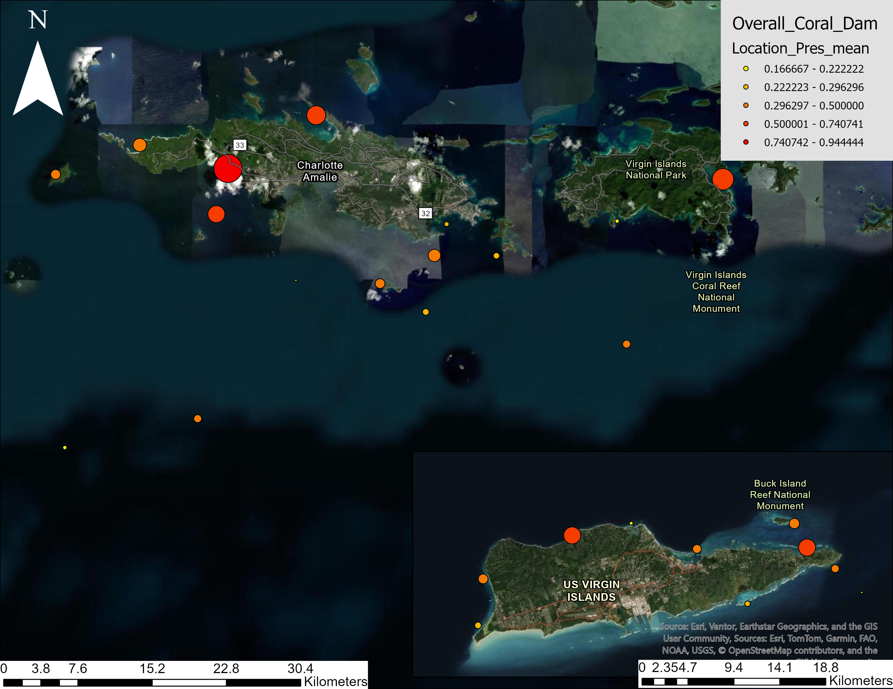

## Damselfish Population Trends from 2013-2025

The Territorial Coral Reef Monitoring Program (TCRMP) has fish abundance and biomass data from 2002; however, records of damselfish-coral interactions are not consistent until 2013 which is why I am looking at trends from 2013-2025.

TCRMP measures fish abundance by using ten transects (25 x 4 m) and three 15-minute roving surveys at each site per year. This map shows all damselfish species in abundance across the US Virgin Islands (Figure No. 1). 


```{r}
####Libraries########
library(tidyverse)
library(readxl)
library(ggplot2)
library(car)
library(emmeans)
library(multcomp)
library(MASS)

#GOAL: average damselfish abundance for every TCRMP site from 2013-2025

TCRMP_SITE <- read.csv("TCRMP_datasets/TCRMP_Site_Metadata.xls - SiteMetadata.csv") # loading TCRMP SITE data

TCRMP_FISH_RAW <- read.csv("TCRMP_datasets/TCRMP_FISH/APR2026/TCRMP_Master_Fish_Census_Apr2026_Abundance.csv") # TCRMP FISH data


TCRMP_FISH <- subset(TCRMP_FISH_RAW, select = -c(SampleDate, SampleMonth , Period, CommonName, Observer, TrophicGroup, X0.5, X6.10, X11.20, X21.30, X31.40, X41.50, X51.60, X61.70, X71.80, X81.90, X91.100, X101.110, X111.120, X121.130, X131.140, X141.150, X.150)) %>%  #removing excess columns
  dplyr::filter(!dplyr::between(as.numeric (SampleYear), 2003, 2012)) #filter data to 2013-2025

CLEAN_TCRMP_FISH <- left_join(TCRMP_FISH, TCRMP_SITE[, c("Location", "Depth", "Island" )], by = "Location") #attaching island names and depth to dataset

TABUND_DAMSEL <- dplyr::filter(CLEAN_TCRMP_FISH,
                              ScientificName %in% c(
                                "Microspathodon chrysurus",
                                "Stegastes partitus",
                                "Stegastes variabilis",
                                "Stegastes adustus",
                                "Stegastes leucostictus",
                                "Stegastes planifrons"
                              )) # filter fish species to damselfish only
##########################################################################################################################################################
#####################  DAMSELFISH DENSITY       #############################

TTRANS_MEAN_ABUND_DAMSEL <- TABUND_DAMSEL %>% # mean of damselfish abundance along each transect by year and location
  group_by(Location, Transect, SampleYear) %>% 
  summarise(
    Sum_Abundance= sum(SppTotal),
    Mean_Abundance  = mean(SppTotal) ,
    .groups = "drop") %>% 
  unique()

TABUNDANCE_DAMSELFISH <- TTRANS_MEAN_ABUND_DAMSEL  %>% # Mean of damselfish abundance along each site per year and location
  group_by(Location, SampleYear)  %>% 
  summarise(
    Location_Abundance_mean = (sum(Mean_Abundance))/10 #10 is the transect per site
  )

TMAP_ABUNDANCE_DAMSELFISH <- TABUNDANCE_DAMSELFISH  %>% # Mean of damselfish Abundance along each site 
  group_by(Location)  %>% 
  summarise(
    Location_Abundance_mean = (mean(Location_Abundance_mean))
  )

##################### St. Thomas ############################
STT_ADAMS <- dplyr::filter(TABUND_DAMSEL, #Only including St. Thomas sites
                          Island %in% c(
                             "STT"
                           ))

STT_TAMD <- STT_ADAMS %>% # mean of damselfish abundance along each transect by year and location
  group_by(Location, Transect, SampleYear) %>% 
  summarise(
    Mean_Abundance = mean(SppTotal) ,
    .groups = "drop") %>% 
  unique()

TSTT_ABUNDANCE_DAMSELFISH <- STT_TAMD  %>% # Mean of damselfish abundance along each site per year and location
  group_by(Location, SampleYear)  %>% 
  summarise(
    Location_Abundance_Mean = (sum(Mean_Abundance))/10 #10 is the transect per site
  )

TSTT_ABUNDANCE_LPLOT <- ggplot(TSTT_ABUNDANCE_DAMSELFISH, aes(x = SampleYear , y = Location_Abundance_Mean, group= Location, color = Location)) +
  geom_line() +
  scale_x_continuous(breaks = seq(min(TSTT_ABUNDANCE_DAMSELFISH$SampleYear), max(TSTT_ABUNDANCE_DAMSELFISH$SampleYear), by = 1)) +
  labs(title = "Damselfish Abundance at St. Thomas TCRMP Sites From 2013-2025") +
  labs(x = "Year", y= "Damselfish Mean Abundance") +
  labs(caption = "Figure No. 3. Average Damselfish Abundance of TCRMP Sites on St. Thomas, USVI from 2013-2025") +
  theme_minimal() +
  theme(plot.caption = element_text(hjust = 0.5)) +
  theme(legend.position = "right") +
  theme(axis.text.x = element_text(angle = 45, hjust = 1)) 

################# St. Croix #####################

STX_ADAMS <- dplyr::filter(TABUND_DAMSEL, #Only including St. Thomas sites
                          Island %in% c(
                            "STX"
                          ))

STX_TAMD <- STX_ADAMS %>% # mean of damselfish abundance along each transect by year and location
  group_by(Location, Transect, SampleYear) %>% 
  summarise(
    Mean_Abundance = mean(SppTotal) ,
    .groups = "drop") %>% 
  unique()

TSTX_ABUNDANCE_DAMSELFISH <- STX_TAMD  %>% # Mean of damselfish abundance along each site per year and location
  group_by(Location, SampleYear)  %>% 
  summarise(
    Location_Abundance_Mean = (sum(Mean_Abundance))/10 #10 is the transect per site
  )

TSTX_ABUNDANCE_LPLOT <- ggplot(TSTX_ABUNDANCE_DAMSELFISH, aes(x=SampleYear , y = Location_Abundance_Mean, group= Location, color = Location)) + 
  geom_line() +
  scale_x_continuous(breaks = seq(min(TSTX_ABUNDANCE_DAMSELFISH$SampleYear), max(TSTX_ABUNDANCE_DAMSELFISH$SampleYear), by = 1)) + # damselfish abundance from 2013-2025 on St Croix 
  labs(title = "Damselfish Abundance at St. Croix TCRMP Sites From 2013-2025") +
  labs(x= "Year", y= "Damselfish Mean Abundance") +
  labs(caption = "Figure No. 6. Average Damselfish Abundance at TCRMP Sites on St. Croix, USVI from 2013-2025") +
  theme_minimal() +
  theme(legend.position = "right") +
  theme(plot.caption = element_text(hjust = 0.5)) +
  theme(axis.text.x = element_text(angle = 45, hjust = 1)) 

############## ST. JOHN ######################

STJ_ADAMS <- dplyr::filter(TABUND_DAMSEL, #Only including St. Thomas sites
                           Island %in% c(
                             "STJ"
                          ))

TSTJ_TAMD <- STJ_ADAMS %>% # mean of damselfish abundance along each transect by year and location
  group_by(Location, Transect, SampleYear) %>% 
  summarise(
    Mean_Abundance  = mean(SppTotal) ,
    .groups = "drop") %>% 
  unique()

TSTJ_ABUNDANCE_DAMSELFISH <- TSTJ_TAMD  %>% # Mean of damselfish abundance along each site per year and location
  group_by(Location, SampleYear)  %>% 
  summarise(
    Location_Abundance_Mean = (sum(Mean_Abundance))/10 #10 is the transect per site
  )

TSTJ_ABUNDANCE_LPLOT <- ggplot(TSTJ_ABUNDANCE_DAMSELFISH, aes(x=SampleYear , y = Location_Abundance_Mean, group= Location, color = Location)) + 
  geom_line() + # damselfish abundance from 2013-2025 on St John
  scale_x_continuous(breaks = seq(min(TSTJ_ABUNDANCE_DAMSELFISH$SampleYear), max(TSTJ_ABUNDANCE_DAMSELFISH$SampleYear), by = 1)) +
  labs(title = "Damselfish Abundance at St. John TCRMP Sites From 2013-2025") +
  labs(x= "Year", y= "Mean Abundance") +
  labs(caption = "Figure No. 5. Average Damselfish Abundance at TCRMP Sites St. John, USVI from 2013-2025") +
  theme_minimal() +
  theme(plot.caption = element_text(hjust = 0.5)) +
  theme(legend.position = "right") +
  theme(axis.text.x = element_text(angle = 45, hjust = 1)) 

############################################################################################################################################################################# DAMSELFISH ABUNDANCE BY ISLAND #########################

################## St. Thomas #################

TSTT_ALL_ABUNDANCE_DAMSELFISH <- TSTT_ABUNDANCE_DAMSELFISH  %>% # Mean of damselfish abundance on St. Thomas from 2013-2025
  group_by(SampleYear)  %>% 
  summarise(
    Abundance_Mean = (mean(Location_Abundance_Mean))
  )

TSTT_ALL_ABUNDANCE_DAMSELFISH_LPLOT <- ggplot(TSTT_ALL_ABUNDANCE_DAMSELFISH, aes(x = SampleYear , y = Abundance_Mean)) + 
  geom_line() + # damselfish abundance from 2013-2025 on St Thomas 
  scale_x_continuous(breaks = seq(min(TSTT_ALL_ABUNDANCE_DAMSELFISH$SampleYear), max(TSTT_ALL_ABUNDANCE_DAMSELFISH$SampleYear), by = 1)) + 
  labs(x= "Year", y= " Damselfish Mean Abundance") +
  labs(caption = "Figure No. ?. St. Thomas Average Damselfish Abundance From 2013-2025") +
  theme_minimal() +
  theme(plot.caption = element_text(hjust = 0.5)) +
  theme(legend.position = "right") +
  theme(axis.text.x = element_text(angle = 45, hjust = 1)) 

################ ST. CROIX ###################

TSTX_ALL_ABUNDANCE_DAMSELFISH <- TSTX_ABUNDANCE_DAMSELFISH  %>% # Mean of damselfish abundance on St. Croix from 2013-2025
  group_by(SampleYear)  %>% 
  summarise(
    Abundance_Mean = (mean(Location_Abundance_Mean))
  )

TSTX_ALL_ABUNDANCE_DAMSELFISH_LPLOT <- ggplot(TSTX_ALL_ABUNDANCE_DAMSELFISH, aes(x = SampleYear , y = Abundance_Mean)) + 
  geom_line() + # damselfish abundance from 2013-2025 on St Croix 
  scale_x_continuous(breaks = seq(min(TSTX_ALL_ABUNDANCE_DAMSELFISH$SampleYear), max(TSTX_ALL_ABUNDANCE_DAMSELFISH$SampleYear), by = 1)) + 
  labs(x= "Year", y= "Mean Abundance") +
  labs(caption = "Figure No. ?. St. Croix Average Damselfish Abundance From 2013-2025") +
  theme_minimal() +
  theme(plot.caption = element_text(hjust = 0.5)) +
  theme(legend.position = "right") +
  theme(axis.text.x = element_text(angle = 45, hjust = 1)) 

################# ST. JOHN #########################

TSTJ_ALL_ABUNDANCE_DAMSELFISH <- TSTJ_ABUNDANCE_DAMSELFISH  %>% # Mean of damselfish abundance on St. John from 2013-2021
  group_by(SampleYear)  %>% 
  summarise(
    Abundance_Mean = (mean(Location_Abundance_Mean))
  )

STJ_ALL_ABUNDANCE_DAMSELFISH_LPLOT <- ggplot(TSTJ_ALL_ABUNDANCE_DAMSELFISH, aes(x = SampleYear , y = Abundance_Mean)) + 
  geom_line() + # damselfish abundance from 2013-2022 on St John 
  scale_x_continuous(breaks = seq(min(TSTJ_ALL_ABUNDANCE_DAMSELFISH$SampleYear), max(TSTJ_ALL_ABUNDANCE_DAMSELFISH$SampleYear), by = 1)) + 
  labs(x= "Year", y= "Mean Abundance") +
  labs(caption = "Figure No. ?. St. John Average Damselfish Abundance From 2013-2025") +
  theme_minimal() +
  theme(plot.caption = element_text(hjust = 0.5)) +
  theme(legend.position = "right") +
  theme(axis.text.x = element_text(angle = 45, hjust = 1)) 

######### MERGING THEM TOGETHER ############
##adding columns of site to each dataset

TSTT_ALL_ABUNDANCE_DAMSELFISH$Site <- "St. Thomas"
TSTX_ALL_ABUNDANCE_DAMSELFISH$Site <- "St. Croix"
TSTJ_ALL_ABUNDANCE_DAMSELFISH$Site <- "St. John"


TUSVI_ABUNDANCE <- bind_rows(TSTT_ALL_ABUNDANCE_DAMSELFISH ,
                            TSTX_ALL_ABUNDANCE_DAMSELFISH, 
                            TSTJ_ALL_ABUNDANCE_DAMSELFISH)

TUSVI_ABUNDANCE_LPLOT <- ggplot(TUSVI_ABUNDANCE, aes(x = SampleYear , y = Abundance_Mean, group = Site , color = Site)) + 
  geom_line() + # damselfish abundance from 2013-2025 in USVI
  scale_color_manual( values = c( 
    "St. Thomas" = "coral" ,
    "St. John" = "green3" , 
    "St. Croix" = "cyan2" 
  )) +
  scale_x_continuous(breaks = seq(min(TUSVI_ABUNDANCE$SampleYear), max(TUSVI_ABUNDANCE$SampleYear), by = 1)) + 
  labs(title = " Average Damselfish Abundance Across US Virgin Islands From 2013-2025") +
  labs(x= "Year", y= "Damselfish Mean Abundance") +
  labs(caption = "Figure No. 2. Average Damselfish Abundance From 2013-2025 Using TCRMP Sites Across the USVI By Island") +
  theme_minimal() +
  theme(legend.position = "right") +
  theme(plot.caption = element_text(hjust = 0.5)) +
  theme(axis.text.x = element_text(angle = 45, hjust = 1)) 
print(TUSVI_ABUNDANCE_LPLOT)
#########################################################################################################################################################################################
## ANOVA 
TUSVI_ABUNDANCE$Abundance_Log <- log(TUSVI_ABUNDANCE$Abundance_Mean) # log it 
TUSVI_ADAM_ANOVA <- aov(Abundance_Log ~ Site, data = TUSVI_ABUNDANCE)
#summary(TUSVI_ADAM_ANOVA)
# CURRENT ANOVA BELOW 
#           Df Sum Sq Mean Sq F value   Pr(>F)    
#Site         2  1.677  0.8387   17.98 3.85e-06 ***
#Residuals   36  1.679  0.0466      

### POSTHOC
TUKEY_USVI_ADAM_ANOVA <- TukeyHSD(TUSVI_ADAM_ANOVA)

 TIsland_ANOVA<- emmeans(TUSVI_ADAM_ANOVA, ~ Site)
 
 TISLAND_POSTHOC <- cld(TIsland_ANOVA, Letter = letters)
 
 TISLAND_POSTHOC$.group <- trimws(TISLAND_POSTHOC$.group)

 TISLAND_POSTHOC$y_pos <- min(TUSVI_ADAM_ANOVA$Abundance_Log, na.rm = TRUE) * 1.1
 
TUSVI_ADAM_BPLOT <- ggplot(TUSVI_ADAM_ANOVA, aes(x = Site , y = Abundance_Log , fill = Site )) +
  geom_boxplot() +
  geom_text(data = TISLAND_POSTHOC,
            aes(x = Site,
                y = y_pos,
                label = .group),
            vjust = 2.1 ,
            inherit.aes = FALSE,
            size = 6) +
  scale_fill_manual(values = c(
    "St. Thomas" = "coral",
    "St. John"   = "green2",
    "St. Croix"  = "cyan2")) +
  scale_y_continuous(limits = c(1.75, 4)) +
  labs(title = "Damselfish Mean Abundance Across TCRMP Sites From 2013-2025") +
  labs( x = "Island" , y = "Damselfish Mean Abundance log(Abundance)") +
  labs(caption = "Figure No. 3. Post Hoc test of Damselfish abundance on St. Thomas, St. John and St. Croix at TCRMP sites from 2013-2025.") +
  theme_minimal() +
  theme(axis.text.x = element_text(angle = 45, hjust = 1))

print(TUSVI_ADAM_BPLOT)

```
Data was visualized of damselfish abundance from 2013-2025 on each island (Figure No. 2). An ANOVA was conducted and revealed the islands have significantly different damselfish abundance and a post-hoc test determined St. Croix has a different average damselfish abundance than St. Thomas and St. John (Figure No. 3). This data set passed the bartlett test (p-value = 0.1889) and Shapiro-Wilks test (p-value = 0.9736) when preformed under a log transformation. 

::: panel-tabset
## St. Thomas

```{r}
print(TSTT_ABUNDANCE_LPLOT) # St. Thomas Damselfish Abundance 2013-2025
```

## St. John

```{r}
print(TSTJ_ABUNDANCE_LPLOT) # St. John Damselfish Abundance 2013-2025
```

## St. Croix

```{r}
print(TSTX_ABUNDANCE_LPLOT)
# St. Croix Damselfish Abundance 2013-2025
```
:::

ANOVAs were conduct to analyze damselfish abundance across TCRMP sites on each island. 

The dataset for St. Thomas does not pass the barlette test after being transformed (p-value = 0.004478). It meets the

::: panel-tabset
## St. Thomas

```{r}

TSTT_ABUNDANCE_DAMSELFISH$Abundance_Log <- log(TSTT_ABUNDANCE_DAMSELFISH$Location_Abundance_Mean) # log it 

TSTT_ADAM_ANOVA <- aov(Abundance_Log ~ Location, data = TSTT_ABUNDANCE_DAMSELFISH)

#summary(TSTT_ADAM_ANOVA) # location is significantly different from one another: P-value = 1.04e-13
#             Df Sum Sq Mean Sq F value   Pr(>F)    
#Location     13  20.10  1.5463   8.915 1.04e-13 ***
# Residuals   166  28.79  0.1735   
TUK_TSTT_ADAM_ANOVA <- TukeyHSD(TSTT_ADAM_ANOVA)

TSTT_ANOVA <- emmeans(TSTT_ADAM_ANOVA, ~ Location)

TSTT_POSTHOC <- cld(TSTT_ANOVA, Letter = letters)

TSTT_POSTHOC$.group <- trimws(TSTT_POSTHOC$.group)

TSTT_POSTHOC$y_pos <- max(TSTT_ABUNDANCE_DAMSELFISH$Abundance_Log, na.rm = TRUE) * 1.1


TSTT_ADAM_BPLOT <- ggplot(TSTT_ABUNDANCE_DAMSELFISH, aes(x = Location , y = Abundance_Log , fill = Location )) +
          geom_boxplot() +
          geom_text(data = TSTT_POSTHOC,
                    aes(x = Location,
                        y = y_pos,
                        label = .group),
                    vjust = 2.1 ,
                    inherit.aes = FALSE,
                    size = 6) +
          labs(title = "Damselfish Mean Abundance Across TCRMP Sites on St. Thomas, USVI From 2013-2025") +
          labs( x = "Island" , y = "Damselfish Mean Abundance log(Abundance)") +
          theme_minimal() +
          theme(plot.caption = element_text(hjust = 0.5)) +
          theme(legend.position = "bottom") +
          theme(axis.text.x = element_text(angle = 45, hjust = 1))
print(TSTT_ADAM_BPLOT)
    

```

## St. John

```{r}

TSTJ_ABUNDANCE_DAMSELFISH$Abundance_Log <- log(TSTJ_ABUNDANCE_DAMSELFISH$Location_Abundance_Mean) # log it 

#bartlett.test(Abundance_Log ~ Location, data = TSTJ_ABUNDANCE_DAMSELFISH) 
# p-value = 0.9652, i fail to reject the hypothesis. This data has homogenity of variances. 

#shapiro.test(TSTJ_ABUNDANCE_DAMSELFISH$Abundance_Log)
#p-value = 0.1746, I fail to reject the hypothesis, this data has normality of residuals

TSTJ_ADAM_ANOVA <- aov(Abundance_Log ~ Location, data = TSTJ_ABUNDANCE_DAMSELFISH)
#summary(TSTJ_ADAM_ANOVA)
# P-value = 8.42e-11, There is signifigant differences in damselfish abundance across St. John TCRMP sites. 
#            Df Sum Sq Mean Sq F value   Pr(>F)    
#Location     2 11.614   5.807   47.31 8.42e-11 ***
#Residuals   36  4.419   0.123      

TUK_TSTJ_ADAM_ANOVA <- TukeyHSD(TSTJ_ADAM_ANOVA)

# Fish Bay has signifgantly different damselfish abundance compared to the other St. John TCRMP sites

TSTJ_ANOVA<- emmeans(TSTJ_ADAM_ANOVA, ~ Location)

TSTJ_POSTHOC <- cld(TSTJ_ANOVA, Letter = letters)

TSTJ_POSTHOC$.group <- trimws(TSTJ_POSTHOC$.group)

TSTJ_POSTHOC$y_pos <- min(TSTJ_ABUNDANCE_DAMSELFISH$Abundance_log, na.rm = TRUE) * 1.1

TSTJ_ADAM_BPLOT <- ggplot(TSTJ_ABUNDANCE_DAMSELFISH, aes(x = Location , y = Abundance_Log , fill = Location )) +
  geom_boxplot() +
  geom_text(data = TSTJ_POSTHOC,
            aes(x = Location,
                y = y_pos,
                label = .group),
            vjust = 1.1 ,
            inherit.aes = FALSE,
            size = 6) +
  scale_y_continuous(limits = c(0, 4)) +
    theme(plot.caption = element_text(hjust = 0.5)) +
  labs(title = " Damselfish Mean Abundance Across TCRMP Sites on St. John From 2013-2025") +
  labs( x = "Location" , y = "Damselfish Mean Abundance log(Abundance)") +
  theme_minimal() +
    theme(legend.position = "bottom") +
  theme(axis.text.x = element_text(angle = 45, hjust = 1))
print(TSTJ_ADAM_BPLOT)


```

## St. Croix

```{r}

TSTX_ABUNDANCE_DAMSELFISH$Abundance_Log <- log(TSTX_ABUNDANCE_DAMSELFISH$Location_Abundance_Mean) # log it 

#bartlett.test(Abundance_Log ~ Location, data = TSTX_ABUNDANCE_DAMSELFISH) 
#p-value = 0.9464, failed to reject hypothesis

#shapiro.test(TSTX_ABUNDANCE_DAMSELFISH$Abundance_Log)
# p-value =  p-value = 0.01692, REJECT the hypothesis


TSTX_ADAM_ANOVA <- aov(Abundance_Log ~ Location, data = TSTX_ABUNDANCE_DAMSELFISH)
#summary(TSTX_ADAM_ANOVA)
#P-value is <2e-16, St. Croix TCRMP sites has signifgantly different damselfish abundances
#             Df Sum Sq Mean Sq F value Pr(>F)    
#Location     11  61.17   5.561    30.5 <2e-16 ***
#Residuals   139  25.35   0.182                   
TUK_TSTX_ADAM_ANOVA <- TukeyHSD(TSTX_ADAM_ANOVA)

TSTX_ANOVA <- emmeans(TSTX_ADAM_ANOVA, ~ Location)

TSTX_POSTHOC <- cld(TSTX_ANOVA, Letter = letters)

TSTX_POSTHOC$.group <- trimws(TSTX_POSTHOC$.group)

TSTX_POSTHOC$y_pos <- max(TSTX_ABUNDANCE_DAMSELFISH$Abundance_Log, na.rm = TRUE) * 1.1


TSTX_ADAM_BPLOT <- ggplot(TSTX_ABUNDANCE_DAMSELFISH, aes(x = Location , y = Abundance_Log , fill = Location )) +
  geom_boxplot() +
  geom_text(data = TSTX_POSTHOC,
            aes(x = Location,
                y = y_pos,
                label = .group),
            inherit.aes = FALSE,
            size = 6) +
  labs(title = "Damselfish Mean Abundance at TCRMP Sites on St. Croix") +
  labs( x = "Location" , y = "Damselfish Mean Abundance log(Abundance)") +
  labs(caption = "This dataset did not pass Shapiro-Wilk test") +
  theme(plot.caption = element_text(hjust = 0.5)) +
  theme_minimal() +
  theme(legend.position = "bottom") +
  theme(axis.text.x = element_text(angle = 45, hjust = 1))
print(TSTX_ADAM_BPLOT)
```
:::

## Damselfish Distrubution By Species

There are six damselfish species native to the Caribbean. These fish are small \<10cm. Damselfishes are detrivores, omnivores, and primarily herbivores.

5/6 damselfish species are considered "farmerfish". They create algal farms within their 1m\^2 territories by propgating algae and attaching it to corals or hard substrate. They guard these algal gardens.

Damselfish are considered solitary fish with aggressive behaviors. They are seen attacking and chasing other marine animals when they feel threatened or if the animal is too close to their algal gardens.

### Stegates Planifrons (Threespot Damselfish)


Stegates planifrons are Adults have brownish-black body with a yellow-gray underbelly and juveniles are fully yellow. and notably more aggressive than other species of damselfish. T

```{r}
TABUND_SP <- dplyr::filter(CLEAN_TCRMP_FISH, ScientificName %in% c(
                            "Stegastes planifrons"
                          ))

#######################################################################################################################################################################  STEGATES PLANIFRONS ACROSS USVI ##############################

TUSVI_TAMSP <- TABUND_SP %>% # mean of damselfish abundance along each transect by year and location
  group_by(Location, Transect, SampleYear) %>% 
  summarise(
    Island = Island ,
    Mean_Abundance  = mean(SppTotal) ,
    .groups = "drop") %>% 
  unique()

TUSVI_ABUNDANCE_SP <- TUSVI_TAMSP  %>% # Mean of damselfish abundance along each site per year and Island
  group_by(Island, SampleYear)  %>% 
  summarise(
    Abundance_Mean = (sum(Mean_Abundance))/10 #10 is the transect per site
  )

TUSVIABUNDANCE_SP_LPLOT <- ggplot(TUSVI_ABUNDANCE_SP, aes(x = SampleYear , y = Abundance_Mean, group= Island, color = Island)) +
  geom_line() +
  scale_color_manual(values = c(
    "STT" = "coral",
    "STJ"   = "green2",
    "STX"  = "cyan2")) +
  scale_x_continuous(breaks = seq(min(TUSVI_ABUNDANCE_SP$SampleYear), max(TUSVI_ABUNDANCE_SP$SampleYear), by = 1)) +
  labs(title = "Average Stegates planifrons Abundance at TCRMP Sites in the USVI from 2013-2025") +
  labs(x= "Year", y= "Stegates planifrons Mean Abundance") +
  labs(caption = "Figure No. ?. Average stegates planifrons abundance at TCRMP sites from 2013-2025. These sites are located on St. Thomas (STT), St. Croix (STX), and St. John (STJ).") +
  theme_minimal() +
  theme(plot.caption = element_text(hjust = 0.5)) +
  theme(legend.position = "right") +
  theme(axis.text.x = element_text(angle = 45, hjust = 1)) 

################################################################################################################################################################## STEGATES PLANIFRONS ABUNDANCE BY ISLAND ############################

################# ST. THOMAS ########################################
TSTT_ASP <- dplyr::filter(TABUND_SP, #Only including St. Thomas sites
                         Island %in% c(
                           "STT"
                         ))

TSTT_TAMSP <- TSTT_ASP %>% # mean of damselfish abundance along each transect by year and location
  group_by(Location, Transect, SampleYear) %>% 
  summarise(
    Mean_Abundance  = mean(SppTotal) ,
    .groups = "drop") %>% 
  unique()

TSTT_ABUNDANCE_SP <- TSTT_TAMSP  %>% # Mean of damselfish abundance along each site per year and location
  group_by(Location, SampleYear)  %>% 
  summarise(
    Location_Abundance_Mean = (sum(Mean_Abundance))/10 #10 is the transect per site
  )

TSTT_ABUNDANCE_SP_LPLOT <- ggplot(TSTT_ABUNDANCE_SP, aes(x = SampleYear , y = Location_Abundance_Mean, group= Location, color = Location)) + # St. Thomas plot of Stegates planiforns from 2013-2025
  geom_line() +
  scale_x_continuous(breaks = seq(min(TSTT_ABUNDANCE_SP$SampleYear), max(TSTT_ABUNDANCE_SP$SampleYear), by = 1)) +
  labs(title = "Average Stegates Planifrons Abundance at St. Thomas from 2013-2025") +
  theme(plot.caption = element_text(hjust = 0.5)) +
  labs(x= "Year", y= "Stegates planifrons Mean Abundance") +
  labs(caption = "Figure No. ?. Average Stegates planifrons Abundance at St. Thomas TCRMP sites from 2013-2025.") +
  theme_minimal() +
  theme(legend.position = "right") +
  theme(plot.caption = element_text(hjust = 0.5)) +
  theme(axis.text.x = element_text(angle = 45, hjust = 1)) 

################# ST. CROIX ############################

TSTX_ASP <- dplyr::filter(TABUND_SP, #Only including St. Croix sites
                        Island %in% c(
                          "STX"
                        ))

TSTX_TAMSP <- TSTX_ASP %>% # mean of damselfish abundance along each transect by year and location
  group_by(Location, Transect, SampleYear) %>% 
  summarise(
    Mean_Abundance  = mean(SppTotal) ,
    .groups = "drop") %>% 
  unique()

TSTX_ABUNDANCE_SP <- TSTX_TAMSP  %>% # Mean of damselfish abundance along each site per year and location
  group_by(Location, SampleYear)  %>% 
  summarise(
    Location_Abundance_Mean = (sum(Mean_Abundance))/10 #10 is the transect per site
  )

TSTX_ABUNDANCE_SP_LPLOT <- ggplot(TSTX_ABUNDANCE_SP, aes(x = SampleYear , y = Location_Abundance_Mean, group= Location, color = Location)) + # St. Croix plot of Stegates planifrons from 2013-2025
  geom_line() +
  scale_x_continuous(breaks = seq(min(TSTX_ABUNDANCE_SP$SampleYear), max(TSTX_ABUNDANCE_SP$SampleYear), by = 1)) +
  labs(title = "Average Stegates Planifrons Abundance at St. Croix from 2013-2025") +
  labs(x= "Year", y= "Stegates planifrons Mean Abundance") +
  labs(caption = "Figure No. ?. Average Stegates planifrons Abundance at St. Croix TCRMP sites from 2013-2025.") +
  theme_minimal() +
  theme(plot.caption = element_text(hjust = 0.5)) +
  theme(legend.position = "right") +
  theme(axis.text.x = element_text(angle = 45, hjust = 1)) 

#################### ST. JOHN ################################

TSTJ_ADAMSP <- dplyr::filter(TABUND_SP, #Only including St. John sites
                           Island %in% c(
                             "STJ"
                           ))


TSTJ_TAMSP <- TSTJ_ADAMSP %>% # mean of damselfish abundance along each transect by year and location
  group_by(Location, Transect, SampleYear) %>% 
  summarise(
    Mean_Abundance  = mean(SppTotal) ,
    .groups = "drop") %>% 
  unique()

TSTJ_ABUNDANCE_SP <- TSTJ_TAMSP  %>% # Mean of damselfish abundance along each site per year and location
  group_by(Location, SampleYear)  %>% 
  summarise(
    Location_Abundance_Mean = (sum(Mean_Abundance))/10 #10 is the transect per site
  )

TSTJ_ABUNDANCE_SP_LPLOT <- ggplot(TSTJ_ABUNDANCE_SP, aes(x = SampleYear , y = Location_Abundance_Mean, group= Location, color = Location)) + # Plot of St. John sites and damselfish abundance
  geom_line() +
  scale_x_continuous(breaks = seq(min(TSTJ_ABUNDANCE_SP$SampleYear), max(TSTJ_ABUNDANCE_SP$SampleYear), by = 1)) +
  labs(title = "Average Stegates Planifrons Abundance at St. John from 2013-2025")+
  labs(x= "Year", y= "Stegates planifrons Mean Abundance") +
  labs(caption = "Figure No. ?. Average Stegates planifrons Abundance at St. John TCRMP sites from 2013-2025.") +
  theme_minimal() +
    theme(plot.caption = element_text(hjust = 0.5)) +
  theme(plot.caption = element_text(hjust = 0.5)) +
  theme(legend.position = "right") +
  theme(axis.text.x = element_text(angle = 45, hjust = 1)) 

############################################################################################################################################################################################################################################################### STATS TIME #######################################

# Is there a significance difference of SP abundance across the islands in the USVI?

### ASUMPTIONS 

#1.) Homoscedasticity
#bartlett.test(Abundance_Mean ~ Island, data = TUSVI_ABUNDANCE_SP) 

# p-value = 7.404e-05, I reject the hypothesis. This dataset DOES NOT HAVE homogenity of variances

TUSVI_ABUNDANCE_SP$Abundance_Log <- log(TUSVI_ABUNDANCE_SP$Abundance_Mean) # log it 
#bartlett.test(Abundance_Log ~ Island, data = TUSVI_ABUNDANCE_SP) 
#p-value = 0.4195, I reject to fail the hypothesis, the log version has homogenity of variances

#2.) Normality
#shapiro.test(TUSVI_ABUNDANCE_SP$Abundance_Log)
#p-value = 0.01415 , DOES NOT PASS, USE CAUTION

TUSVI_ASP_ANOVA <- aov(Abundance_Log ~ Island, data = TUSVI_ABUNDANCE_SP)
#summary(TUSVI_ASP_ANOVA)
#            Df Sum Sq Mean Sq F value   Pr(>F)    
#Island       2 17.219   8.609   77.64 8.78e-14 ***
#Residuals   36  3.992   0.111   
# SP abundance is significantly different across the USVI

################### POST HOC ###################

TUK_TUSVI_ASP_ANOVA <- TukeyHSD(TUSVI_ASP_ANOVA)

TUSVI_Island_ANOVA<- emmeans(TUSVI_ASP_ANOVA, ~ Island)

TUSVI_ISLAND_POSTHOC <- cld(TUSVI_Island_ANOVA, Letter = letters)

TUSVI_ISLAND_POSTHOC$.group <- trimws(TUSVI_ISLAND_POSTHOC$.group)

TUSVI_ISLAND_POSTHOC$Post_Hoc <- min(TUSVI_ASP_ANOVA$Abundance_Log, na.rm = TRUE) * 1.1

TUSVI_ASP_BPLOT <- ggplot(TUSVI_ASP_ANOVA, aes(x = Island , y = Abundance_Log , fill = Island)) +
  geom_boxplot() +
  geom_text(data = TUSVI_ISLAND_POSTHOC,
            aes(x = Island,
                y = Post_Hoc,
                label = .group),
            vjust = 2.1 ,
            inherit.aes = FALSE,
            size = 6) +
  scale_y_continuous(limits = c(0, 6)) +
  scale_fill_manual(values = c(
    "STT" = "coral",
    "STJ"   = "green2",
    "STX"  = "cyan2")) +
  labs(title = "Stegates planifrons Mean Abundance Across TCRMP Sites From 2013-2025") +
  labs(caption = "Stegates planifrons Mean Abundance on St. Thomas (STT), St. Croix (STX), and St. John(STJ). This data did not pass the Shapiro-Wilks test.") +
  labs(x = "Island" , y = "Stegates planifrons Mean Abundance log(Abundance)") +
  theme(plot.caption = element_text(hjust = 0.5)) +
  theme_minimal() +
  theme(axis.text.x = element_text(angle = 45, hjust = 1))


```

::: panel-tabset
## US Virgin Islands

```{r}
print(TUSVIABUNDANCE_SP_LPLOT)
```

## Post-Hoc Box Plot

```{r}
print(TUSVI_ASP_BPLOT) 
```

:::
No analysis on species abundance on TCRMP sites have been conducted. Data does not meet assumptions. 
::: panel-tabset
## St. Thomas

```{r}
print(TSTT_ABUNDANCE_SP_LPLOT)
```

## St. John

```{r}
print(TSTJ_ABUNDANCE_SP_LPLOT) # St. John plot
```

## St. Croix

```{r}
print(TSTX_ABUNDANCE_SP_LPLOT) # St. Croix plot
```
:::

### Stegates Variabilis (Cocoa Damselfish)


```{r}
TABUND_SV <- dplyr::filter(CLEAN_TCRMP_FISH,
                          ScientificName %in% c(
                            "Stegastes variabilis"
                          ))

####################################################################################################################################################################  STEGATES VARIABILIS ACROSS USVI ##############################

TUSVI_TAMSV <- TABUND_SV %>% # mean of damselfish abundance along each transect by year and location
  group_by(Location, Transect, SampleYear) %>% 
  summarise(
    Island = Island ,
    Mean_Abundance  = mean(SppTotal) ,
    .groups = "drop") %>% 
  unique()

TUSVI_ABUNDANCE_SV <- TUSVI_TAMSV  %>% # Mean of damselfish abundance along each site per year and Island
  group_by(Island, SampleYear)  %>% 
  summarise(
    Abundance_Mean = (sum(Mean_Abundance))/10 #10 is the transect per site
  )

TUSVIABUNDANCE_SV_LPLOT <- ggplot(TUSVI_ABUNDANCE_SV, aes(x = SampleYear , y = Abundance_Mean, group= Island, color = Island)) +
  geom_line() +
  scale_color_manual(values = c(
    "STT" = "coral",
    "STJ"   = "green2",
    "STX"  = "cyan2")) +
  scale_x_continuous(breaks = seq(min(TUSVI_ABUNDANCE_SV$SampleYear), max(TUSVI_ABUNDANCE_SV$SampleYear), by = 1)) +
  labs(title = "Average Stegates variabilis Abundance at TCRMP Sites in the USVI from 2013-2025") +
  labs(x= "Year", y= "Stegates variabilis Mean Abundance") +
  labs(caption = "Figure No. ?. Average Stegates variabilis abundance at TCRMP sites from 2013-2025. These sites are located on St. Thomas (STT), St. Croix (STX), and St. John (STJ).") +
  theme_minimal() +
  theme(legend.position = "right") +
  theme(plot.caption = element_text(hjust = 0.5)) +
  theme(axis.text.x = element_text(angle = 45, hjust = 1)) 

print(TUSVIABUNDANCE_SV_LPLOT)

################### ST. THOMAS ###########################


TSTT_ASV <- dplyr::filter(TABUND_SV, #Only including St. Thomas sites
                         Island %in% c(
                           "STT"
                         ))

TSTT_TAMSV <- TSTT_ASV %>% # mean of damselfish abundance along each transect by year and location
  group_by(Location, Transect, SampleYear) %>% 
  summarise(
    Mean_Abundance  = mean(SppTotal) ,
    .groups = "drop") %>% 
  unique()

TSTT_ABUNDANCE_SV <- TSTT_TAMSV  %>% # Mean of damselfish abundance along each site per year and location
  group_by(Location, SampleYear)  %>% 
  summarise(
    Location_Abundance_Mean = (sum(Mean_Abundance))/10 #10 is the transect per site
  )

TSTT_ABUNDANCE_SV_LPLOT <- ggplot(TSTT_ABUNDANCE_SV, aes(x = SampleYear , y = Location_Abundance_Mean, group= Location, color = Location)) +
  geom_line() +
  scale_x_continuous(breaks = seq(min(TSTT_ABUNDANCE_SV$SampleYear), max(TSTT_ABUNDANCE_SV$SampleYear), by = 1)) +
  labs(title = "Stegates Variabilis Abundance at TCRMP Sites on St. Thomas") +
  labs(x= "Year", y= "Stegates variabilis Mean Abundance") +
  labs(caption = "Figure No. ?. Average Stegates variabilis Abundance at TCRMP Sites on St. Thomas") +
  theme_minimal() +
  theme(legend.position = "right") +
  theme(plot.caption = element_text(hjust = 0.5)) +
  theme(axis.text.x = element_text(angle = 45, hjust = 1)) 

############################# ST. CROIX ##################################

TSTX_ASV <- dplyr::filter(TABUND_SV, #Only including St. Thomas sites
                        Island %in% c(
                          "STX"
                        ))

TSTX_TAMSV <- TSTX_ASV %>% # mean of damselfish abundance along each transect by year and location
  group_by(Location, Transect, SampleYear) %>% 
  summarise(
    Mean_Abundance  = mean(SppTotal) ,
    .groups = "drop") %>% 
  unique()

TSTX_ABUNDANCE_SV <- TSTX_TAMSV  %>% # Mean of damselfish abundance along each site per year and location
  group_by(Location, SampleYear)  %>% 
  summarise(
    Location_Abundance_Mean = (sum(Mean_Abundance))/10 #10 is the transect per site
  )

TSTX_ABUNDANCE_SV_LPLOT <- ggplot(TSTX_ABUNDANCE_SV, aes(x = SampleYear , y = Location_Abundance_Mean, group= Location, color = Location)) + 
  geom_line() +
  scale_x_continuous(breaks = seq(min(TSTX_ABUNDANCE_SV$SampleYear), max(TSTX_ABUNDANCE_SV$SampleYear), by = 1)) +
  labs(title = "Stegates Variabilis Abundance at TCRMP Sites on St. Croix") +
  labs(x= "Year", y= "Stegates variabilis Mean Abundance") + 
  labs(caption = "Figure No. ?. Average Stegates variabilis Abundance at TCRMP Sites on St. Croix") +
  theme_minimal() +
  theme(legend.position = "right") +
  theme(plot.caption = element_text(hjust = 0.5)) +
  theme(axis.text.x = element_text(angle = 45, hjust = 1)) 

##################### ST. JOHN ##################################

TSTJ_TAMSV <- dplyr::filter(TABUND_SV, #Only including St. Thomas sites
                           Island %in% c(
                             "STJ"
                           ))

TSTJ_TAMSV <- TSTJ_TAMSV %>% # mean of damselfish abundance along each transect by year and location
  group_by(Location, Transect, SampleYear) %>% 
  summarise(
    Mean_Abundance  = mean(SppTotal) ,
    .groups = "drop") %>% 
  unique()

TSTJ_ABUNDANCE_SV <- TSTJ_TAMSV  %>% # Mean of damselfish abundance along each site per year and location
  group_by(Location, SampleYear)  %>% 
  summarise(
    Location_Abundance_Mean = (sum(Mean_Abundance))/10 #10 is the transect per site
  )

TSTJ_ABUNDANCE_SV_LPLOT <- ggplot(TSTJ_ABUNDANCE_SV, aes(x = SampleYear , y = Location_Abundance_Mean, group= Location, color = Location)) + 
  geom_line() +
  scale_x_continuous(breaks = seq(min(TSTJ_ABUNDANCE_SV$SampleYear), max(TSTJ_ABUNDANCE_SV$SampleYear), by = 1)) +
  labs(title = "Stegates Variabilis Abundance at TCRMP Sites on St. John") +
  labs(x= "Year", y= "Stegates variabilis Mean Abundance") + 
  labs(caption = "Figure No. ?. Average Stegates variabilis Abundance at TCRMP Sites on St. John") +
  theme(legend.position = "right") +
  theme(plot.caption = element_text(hjust = 0.5)) +
  theme(axis.text.x = element_text(angle = 45, hjust = 1)) 

############################################################################################################################################################################################################################################################# STATS TIME #######################################

# Is there a significance difference of SA abundance across the islands in the USVI?

### ASUMPTIONS 

#1.) Homoscedasticity
#bartlett.test(Abundance_Mean ~ Island, data = TUSVI_ABUNDANCE_SV) 
#p-value = 5.303e-06, I reject the hypothesis. This dataset DOES NOT HAVE homogenity of variances

TUSVI_ABUNDANCE_SV$Abundance_Log <- log(TUSVI_ABUNDANCE_SV$Abundance_Mean) # log it 
#bartlett.test(Abundance_Log ~ Island, data = TUSVI_ABUNDANCE_SV) 
#p-value = 0.3927, I reject to fail the hypothesis, the log version has homogenity of variances

#hist(TUSVI_ABUNDANCE_SV$Abundance_Log)
#it decently normal

#2.) Normality
#shapiro.test(TUSVI_ABUNDANCE_SV$Abundance_Log)
#p-value = 0.1343 I fail to reject the hypothesis!!

TUSVI_ASV_ANOVA <- aov(Abundance_Log ~ Island, data = TUSVI_ABUNDANCE_SV)
#summary(TUSVI_ASV_ANOVA)
#            Df Sum Sq Mean Sq F value   Pr(>F)    
#Island       2  24.83  12.413   9.725 0.000457 ***
#Residuals   34  43.40   1.276     
# significance difference of SV abundance across the islands in the USVI

################### POST HOC ###################

TUK_TUSVI_ASV_ANOVA <- TukeyHSD(TUSVI_ASV_ANOVA)

TUSVI_Island_ANOVA<- emmeans(TUSVI_ASV_ANOVA, ~ Island)

TUSVI_ISLAND_POSTHOC <- cld(TUSVI_Island_ANOVA, Letter = letters)

TUSVI_ISLAND_POSTHOC$.group <- trimws(TUSVI_ISLAND_POSTHOC$.group)

TUSVI_ISLAND_POSTHOC$Post_Hoc <- min(TUSVI_ASV_ANOVA$Abundance_Log, na.rm = TRUE) * 1.1

TUSVI_ASV_BPLOT <- ggplot(TUSVI_ASV_ANOVA, aes(x = Island , y = Abundance_Log , fill = Island)) +
  geom_boxplot() +
  geom_text(data = TUSVI_ISLAND_POSTHOC,
            aes(x = Island,
                y = Post_Hoc,
                label = .group),
            vjust = 2.1 ,
            inherit.aes = FALSE,
            size = 6) +
  scale_y_continuous(limits = c(-2.5, 5)) +
  scale_fill_manual(values = c(
    "STT" = "coral",
    "STJ"   = "green2",
    "STX"  = "cyan2")) +
  labs(title = "Stegates variabilis Mean Abundance Across TCRMP Sites From 2013-2025") +
  labs(caption = "Stegates variabilis Mean Abundance on St. Thomas(STT) , St. Croix(STX), and St. John(STJ).") +
  labs(x = "Island" , y = "Stegates variabilis Mean Abundance log(Abundance)") +
  theme_minimal() +
  theme(plot.caption = element_text(hjust = 0.5)) +
  theme(axis.text.x = element_text(angle = 45, hjust = 1))

```
No analysis on species abundance on TCRMP sites have been conducted. Data does not meet assumptions. 

::: panel-tabset
## St. Thomas

```{r}
print(TSTT_ABUNDANCE_SV_LPLOT)
```

## St. John

```{r}
print(TSTJ_ABUNDANCE_SV_LPLOT) # St. John plot
```

## St. Croix

```{r}
print(TSTX_ABUNDANCE_SV_LPLOT) # St. Croix plot
```
:::


### Stegates Leucostictus (Beaugregory Damselfish)


```{r}
TABUND_SL <- dplyr::filter(CLEAN_TCRMP_FISH, 
                           ScientificName %in% c(
                          "Stegastes leucostictus"))

####################################################################################################################################################################  STEGATES LEUCOSTICTUS ACROSS USVI ##############################

TUSVI_TAMSL <- TABUND_SL %>% # mean of damselfish abundance along each transect by year and location
  group_by(Location, Transect, SampleYear) %>% 
  summarise(
    Island = Island ,
    Mean_Abundance  = mean(SppTotal) ,
    .groups = "drop") %>% 
  unique()

TUSVI_ABUNDANCE_SL <- TUSVI_TAMSL  %>% # Mean of damselfish abundance along each site per year and Island
  group_by(Island, SampleYear)  %>% 
  summarise(
    Abundance_Mean = (sum(Mean_Abundance))/10 #10 is the transect per site
  )

TUSVI_ABUNDANCE_SL_LPLOT <- ggplot(TUSVI_ABUNDANCE_SL, aes(x = SampleYear , y = Abundance_Mean, group= Island, color = Island)) +
  geom_line() +
  scale_color_manual(values = c(
    "STT" = "coral",
    "STJ"   = "green2",
    "STX"  = "cyan2")) +
  scale_x_continuous(breaks = seq(min(TUSVI_ABUNDANCE_SL$SampleYear), max(TUSVI_ABUNDANCE_SL$SampleYear), by = 1)) +
  labs(title = "Average Stegates leucostictus Abundance at TCRMP Sites in the USVI from 2013-2025") +
  labs(x= "Year", y= "Stegates leucostictus Mean Abundance") +
  labs(caption = "Figure No. ?. Average Stegates Leucostictus abundance at TCRMP sites from 2013-2025. These sites are located on St. Thomas (STT), St. Croix (STX), and St. John (STJ).") +
  theme_minimal() +
  theme(legend.position = "right") +
  theme(plot.caption = element_text(hjust = 0.5)) +
  theme(axis.text.x = element_text(angle = 45, hjust = 1)) 


#######################################################################################################################################################################  STEGATES LEUCOSTICTUS BY ISLAND ###########################

############# ST. THOMAS ###############################

TSTT_ASL <- dplyr::filter(TABUND_SL, #Only including St. Thomas sites
                         Island %in% c(
                           "STT"
                         ))

TSTT_TAMSL <- TSTT_ASL %>% # mean of damselfish abundance along each transect by year and location
  group_by(Location, Transect, SampleYear) %>% 
  summarise(
    Mean_Abundance  = mean(SppTotal) ,
    .groups = "drop") %>% 
  unique()

TSTT_ABUNDANCE_SL <- TSTT_TAMSL  %>% # Mean of damselfish abundance along each site per year and location
  group_by(Location, SampleYear)  %>% 
  summarise(
    Location_Abundance_Mean = (sum(Mean_Abundance))/10 #10 is the transect per site
  )

TSTT_ABUNDANCE_SL_LPLOT <- ggplot(TSTT_ABUNDANCE_SL, aes(x = SampleYear , y = Location_Abundance_Mean, group= Location, color = Location)) +
  geom_line() +
  scale_x_continuous(breaks = seq(min(TSTT_ABUNDANCE_SL$SampleYear), max(TSTT_ABUNDANCE_SL$SampleYear), by = 1)) +
  labs(title = " Average Stegates leucostictus Abundance on St. Thomas from 2013-2025") +
  labs(x= "Year", y= "Stegates leucostictus Mean Abundance") +
  labs(caption = "Figure No. ?. Average Stegates leucostictus Abundance at TCRMP sites on St. Thomas from 2013-2025") +
  theme_minimal() +
  theme(legend.position = "right") +
  theme(plot.caption = element_text(hjust = 0.5)) +
  theme(axis.text.x = element_text(angle = 45, hjust = 1)) 

####################### ST. CROIX ############################

TSTX_ASL <- dplyr::filter(TABUND_SL, #Only including St. Thomas sites
                        Island %in% c(
                          "STX"
                        ))

STTX_TAMSL <- TSTX_ASL %>% # mean of damselfish abundance along each transect by year and location
  group_by(Location, Transect, SampleYear) %>% 
  summarise(
    Mean_Abundance  = mean(SppTotal) ,
    .groups = "drop") %>% 
  unique()

TSTX_ABUNDANCE_SL <- STTX_TAMSL  %>% # Mean of damselfish abundance along each site per year and location
  group_by(Location, SampleYear)  %>% 
  summarise(
    Location_Abundance_Mean = (sum(Mean_Abundance))/10 #10 is the transect per site
  )

TSTX_ABUNDANCE_SL_LPLOT <- ggplot(TSTX_ABUNDANCE_SL, aes(x = SampleYear , y = Location_Abundance_Mean, group= Location, color = Location)) + 
  geom_line() +
  scale_x_continuous(breaks = seq(min(TSTX_ABUNDANCE_SL$SampleYear), max(TSTX_ABUNDANCE_SL$SampleYear), by = 1)) +
  labs(title = " Average Stegates Leucostictus Abundance on St. Croix from 2013-2025") +
  labs(x = "Year", y = "Stegates leucostictus Mean Abundance") +
  labs(caption = "Figure No. ?. Average Stegates leucostictus Abundance at TCRMP sites on St. Croix from 2013-2025") +
  theme_minimal() +
  theme(legend.position = "right") +
  theme(plot.caption = element_text(hjust = 0.5)) +
  theme(axis.text.x = element_text(angle = 45, hjust = 1)) 

################ ST.JOHN ###########################

TSTJ_ASL <- dplyr::filter(TABUND_SL, #Only including St. John sites
                           Island %in% c(
                             "STJ"))

TSTJ_TAMSL <- TSTJ_ASL %>% # mean of damselfish abundance along each transect by year and location
  group_by(Location, Transect, SampleYear) %>% 
  summarise(
    Mean_Abundance  = mean(SppTotal) ,
    .groups = "drop") %>% 
  unique()

TSTJ_ABUNDANCE_SL <- TSTJ_TAMSL  %>% # Mean of damselfish abundance along each site per year and location
  group_by(Location, SampleYear)  %>% 
  summarise(
    Location_Abundance_Mean = (sum(Mean_Abundance))/10 #10 is the transect per site
  )

TSTJ_ABUNDANCE_SL_LPLOT <- ggplot(TSTJ_ABUNDANCE_SL, aes(x = SampleYear , y = Location_Abundance_Mean, group= Location, color = Location)) + 
  geom_line() +
  scale_x_continuous(breaks = seq(min(TSTJ_ABUNDANCE_SL$SampleYear), max(TSTJ_ABUNDANCE_SL$SampleYear), by = 1)) +
  labs(title = " Average Stegates Leucostictus Abundance on St. John from 2013-2025") +
  labs(x= "Year", y= "Stegates leucostictus Mean Abundance") +
  labs(caption = "Figure No. ?. Average Stegates leucostictus Abundance at TCRMP sites on St. John from 2013-2025") +
  theme_minimal() +
  theme(legend.position = "right") +
  theme(plot.caption = element_text(hjust = 0.5)) +
  theme(axis.text.x = element_text(angle = 45, hjust = 1)) 

```
No analysis on species abundance on TCRMP sites have been conducted. Data does not meet assumptions. 

::: panel-tabset
## St. Thomas

```{r}
print(TSTT_ABUNDANCE_SL_LPLOT)
```

## St. John

```{r}
print(TSTJ_ABUNDANCE_SL_LPLOT) # St. John plot
```

## St. Croix

```{r}
print(TSTX_ABUNDANCE_SL_LPLOT) # St. Croix plot
```
:::

### Stegates Adustus (Dusky Damselfish)


```{r}
TABUND_SA <- dplyr::filter(CLEAN_TCRMP_FISH, ScientificName %in% c(
  "Stegastes adustus")) # filtering dusky species ONLY

#######################################################################################################################################################################  STEGATES ADUSTUS ACROSS USVI ###############################

TUSVI_TAMSA <- TABUND_SA %>% # mean of damselfish abundance along each transect by year and location
  group_by(Location, Transect, SampleYear) %>% 
  summarise(
    Island = Island ,
    Mean_Abundance  = mean(SppTotal) ,
    .groups = "drop") %>% 
  unique()

TUSVI_ABUNDANCE_SA <- TUSVI_TAMSA  %>% # Mean of damselfish abundance along each site per year and Island
  group_by(Island, SampleYear)  %>% 
  summarise(
    Abundance_Mean = (sum(Mean_Abundance))/10 #10 is the transect per site
  )

TUSVIABUNDANCE_SA_LPLOT <- ggplot(TUSVI_ABUNDANCE_SA, aes(x = SampleYear , y = Abundance_Mean, group= Island, color = Island)) +
  geom_line() +
  scale_color_manual(values = c(
    "STT" = "coral",
    "STJ"   = "green2",
    "STX"  = "cyan2")) +
  scale_x_continuous(breaks = seq(min(TUSVI_ABUNDANCE_SA$SampleYear), max(TUSVI_ABUNDANCE_SA$SampleYear), by = 1)) +
  labs(title = "Average Stegates adustus Abundance at TCRMP Sites in the USVI from 2013-2025") +
  labs(x= "Year", y= "Stegates plMean Abundance") +
  labs(caption = "Figure No. ?. Average stegates adustus abundance at TCRMP sites from 2013-2025. These sites are located on St. Thomas (STT), St. Croix (STX), and St. John (STJ).") +
  theme_minimal() +
  theme(legend.position = "right") +
  theme(plot.caption = element_text(hjust = 0.5)) +
  theme(axis.text.x = element_text(angle = 45, hjust = 1)) 

################################################################################################################################################################## STEGATES ADUSTUS ABUNDANCE BY ISLAND ############################

################### ST. THOMAS ##################################

TSTT_ASA <- dplyr::filter(TABUND_SA, #Only including St. Thomas sites
                         Island %in% c(
                           "STT"
                         ))

TSTT_TAMSA <- TSTT_ASA %>% # mean of damselfish abundance along each transect by year and location
  group_by(Location, Transect, SampleYear) %>% 
  summarise(
    Mean_Abundance  = mean(SppTotal) ,
    .groups = "drop") %>% 
  unique()

TSTT_ABUNDANCE_SA <- TSTT_TAMSA  %>% # Mean of damselfish abundance along each site per year and location
  group_by(Location, SampleYear)  %>% 
  summarise(
    Location_Abundance_Mean = (sum(Mean_Abundance))/10 #10 is the transect per site
  )

TSTT_ABUNDANCE_SA_LPLOT <- ggplot(TSTT_ABUNDANCE_SA, aes(x = SampleYear , y = Location_Abundance_Mean, group= Location, color = Location)) +
  geom_line() +
  scale_x_continuous(breaks = seq(min(TSTT_ABUNDANCE_SA$SampleYear), max(TSTT_ABUNDANCE_SA$SampleYear), by = 1)) +
  labs(title = "Average Stegates adustus Abundance at TCRMP Sites on St. Thomas from 2013-2025") +
  labs(x= "Year", y= "Mean Abundance") +
  labs(caption = "Figure No. ?. Average Stegates adustus Abundance at TCRMP Sites on St. Thomas from 2013-2025") +
  theme_minimal() +
  theme(legend.position = "right") +
  theme(plot.caption = element_text(hjust = 0.5)) +
  theme(axis.text.x = element_text(angle = 45, hjust = 1)) 

##################### St. Croix #####################

TSTX_ASA <- dplyr::filter(TABUND_SA, #Only including St. Thomas sites
                        Island %in% c(
                          "STX"
                        ))

TSTX_TAMA <- TSTX_ASA %>% # mean of damselfish abundance along each transect by year and location
  group_by(Location, Transect, SampleYear) %>% 
  summarise(
    Mean_Abundance  = mean(SppTotal) ,
    .groups = "drop") %>% 
  unique()

TSTX_ABUNDANCE_SA <- TSTX_TAMA  %>% # Mean of damselfish abundance along each site per year and location
  group_by(Location, SampleYear)  %>% 
  summarise(
    Location_Abundance_Mean = (sum(Mean_Abundance))/10 #10 is the transect per site
  )

TSTX_ABUNDANCE_SA_LPLOT <- ggplot(TSTX_ABUNDANCE_SA, aes(x = SampleYear , y = Location_Abundance_Mean, group= Location, color = Location)) + 
  geom_line() +
  scale_x_continuous(breaks = seq(min(TSTX_ABUNDANCE_SA$SampleYear), max(TSTX_ABUNDANCE_SA$SampleYear), by = 1)) +
  labs(title = "Average Stegates adustus Abundance at TCRMP Sites on St. Croix from 2013-2025") +
  labs(x= "Year", y= "Stegates adustus Mean Abundance") +
  labs(caption = "Figure No. ?. Average Stegates adustus Abundance at TCRMP Sites on St. Croix from 2013-2025") +
  theme_minimal() +
  theme(legend.position = "right") +
  theme(plot.caption = element_text(hjust = 0.5)) +
  theme(axis.text.x = element_text(angle = 45, hjust = 1)) 

############## St. John #################################

TSTJ_ASA <- dplyr::filter(TABUND_SA, #Only including St. Thomas sites
                        Island %in% c(
                          "STJ"
                        ))


TSTJ_TAMA <- TSTJ_ASA %>% # mean of damselfish abundance along each transect by year and location
  group_by(Location, Transect, SampleYear) %>% 
  summarise(
    Mean_Abundance  = mean(SppTotal) ,
    .groups = "drop") %>% 
  unique()

TSTJ_ABUNDANCE_SA <- TSTJ_TAMA  %>% # Mean of damselfish abundance along each site per year and location
  group_by(Location, SampleYear)  %>% 
  summarise(
    Location_Abundance_Mean = (sum(Mean_Abundance))/10 #10 is the transect per site
  )

TSTJ_ABUNDANCE_SA_LPLOT <- ggplot(TSTJ_ABUNDANCE_SA, aes(x = SampleYear , y = Location_Abundance_Mean, group= Location, color = Location)) + 
  geom_line() +
  scale_x_continuous(breaks = seq(min(TSTJ_ABUNDANCE_SA$ SampleYear), max(TSTJ_ABUNDANCE_SA$ SampleYear), by = 1)) +
  labs(title = "Average Stegates adustus Abundance at TCRMP Sites on St. John from 2013-2025") +
  labs(x= "Year", y= "Stegates adustus Mean Abundance") +
  labs(caption = "Figure No. ?. Average Stegates adustus Abundance at TCRMP Sites on St. John from 2013-2025") +
  theme_minimal() +
  theme(legend.position = "right") +
  theme(plot.caption = element_text(hjust = 0.5)) +
  theme(axis.text.x = element_text(angle = 45, hjust = 1)) 

print(TSTJ_ABUNDANCE_SA_LPLOT)

############################################################################################################################################################################################################################################################### STATS TIME #######################################

# Is there a significance difference of SA abundance across the islands in the USVI?

### ASUMPTIONS 

#1.) Homoscedasticity
#bartlett.test(Abundance_Log ~ Island, data = TUSVI_ABUNDANCE_SA) 

# p-value = 6.765e-06, I reject the hypothesis. This dataset DOES NOT HAVE homogenity of variances

TUSVI_ABUNDANCE_SA$Abundance_Log <- log(TUSVI_ABUNDANCE_SA$Abundance_Mean) # log it 
#p-value = 0.4257, I reject to fail the hypothesis, the log version has homogenity of variances

#hist(TUSVI_ABUNDANCE_SA$Abundance_Log)
#it looks left skewed

#2.) Normality
#shapiro.test(TUSVI_ABUNDANCE_SA$Abundance_Log)
# p-value = 0.01099 , DOES NOT PASS, USE CAUTION

TUSVI_ASA_ANOVA <- aov(Abundance_Log ~ Island, data = TUSVI_ABUNDANCE_SA)
#summary(TUSVI_ASA_ANOVA)
#            Df Sum Sq Mean Sq F value   Pr(>F)    
#Island       2 23.496  11.748   79.53 6.17e-14 ***
#Residuals   36  5.318   0.148   

# yes there is a significance difference of SA abundance across the islands in the USVI

################### POST HOC ###################

TUK_TUSVI_ASA_ANOVA <- TukeyHSD(TUSVI_ASA_ANOVA)

TUSVI_Island_ANOVA<- emmeans(TUSVI_ASA_ANOVA, ~ Island)

TUSVI_ISLAND_POSTHOC <- cld(TUSVI_Island_ANOVA, Letter = letters)

TUSVI_ISLAND_POSTHOC$.group <- trimws(TUSVI_ISLAND_POSTHOC$.group)

TUSVI_ISLAND_POSTHOC$Post_Hoc <- min(TUSVI_ASA_ANOVA$Abundance_Log, na.rm = TRUE) * 1.1

TUSVI_ASA_BPLOT <- ggplot(TUSVI_ASA_ANOVA, aes(x = Island , y = Abundance_Log , fill = Island)) +
  geom_boxplot() +
  geom_text(data = TUSVI_ISLAND_POSTHOC,
            aes(x = Island,
                y = Post_Hoc,
                label = .group),
            vjust = 2.1 ,
            inherit.aes = FALSE,
            size = 6) +
  scale_fill_manual(values = c(
    "STT" = "coral",
    "STJ"   = "green2",
    "STX"  = "cyan2")) +
  labs(title = "Stegates adustus Mean Abundance Across TCRMP Sites From 2013-2025") +
  labs(caption = "Stegates adustus Mean Abundance on St. Thomas, St. Croix, and St. John. This data did not pass the Shapiro-Wilks test.") +
  labs(x = "Island" , y = "Stegates adustus Mean Abundance log(Abundance)") +
  theme_minimal() +
  theme(axis.text.x = element_text(angle = 45, hjust = 1))

## all these diddly darn fish have significantly different abundances across the USVI  
```

::: panel-tabset
## St. Thomas

```{r}
print(TSTT_ABUNDANCE_SA_LPLOT)
```

## St. John

```{r}
print(TSTJ_ABUNDANCE_SA_LPLOT) # St. John plot
```

## St. Croix

```{r}
print(TSTX_ABUNDANCE_SA_LPLOT) # St. Croix plot
```
:::


## Coral Distrubution


The US Virgin Islands is apart of the larger Caribbean hosting (REAL)% of coral populations across the world. Coral cover has been on an active decline and die-offs from keystones species led to altering species composition.

The goal is to: look at coral cover differences from 2013-2025 damselfish-coral interaction hot-spots damselfish-coral host interactions coral disease areas coral bleaching areas

```{r}
TCRMP_SITE <- read.csv("C:/Users/Owner/OneDrive/Documents/GOODMAN_THESIS/TCRMP_datasets/TCRMP_Site_Metadata.xls - SiteMetadata.csv") %>% 
  mutate(Location = toupper(Location))  #MERGING TCRMP SITE WITH CORAL

CORAL_HEALTH_RAW <- read.csv("TCRMP_datasets/TCRMP_CORAL_HEALTH/JUNE2022/TCRMP_Master_Coral_Health_Jan2022.xlsx - HealthDataRaw.csv") ## RAW TCRMP CORAL DATA

#each row describes a location of a singular coral along a transect (6 Transects per site). This coral is identified by its species, LWH, bleaching, mortality, Algal interactions, sponge interactions, and predation) 

#I need to separate the data by site, per year. I want to look at different coral species and which ones have more damselfish presence. 
# I need year, site, annual (?), transect, species, LWH, mortality, bleaching, damselfish pres, bites, lesion, lesion pattern(?). 

unique(CORAL_HEALTH_RAW$SampleYear)

CORAL_HEALTH_CLEAN <- subset(CORAL_HEALTH_RAW, select = c(Location, SampleYear, Period, Transect, SPP, Length, Width, Height, Dict, Lobo, Hali,DamSpp, Notes, BL, P, VP, SP, OldMort, RecMort, Pred1, Pred1ID, Pred2, Pred2ID))  %>% 
dplyr::filter(!dplyr::between(as.numeric (as.character(SampleYear)), 2002, 2012)) #filter data to 2013-2021

### The species that have been recorded are: 
      #Damselfish species (unknown) 
      #Microspathodon chrysurus        #Yellowtail damselfish
      #Stegastes partitus,               #Bicolor damselfish
      #Stegastes variabilis,             #Cocoa damselfish
      #Stegastes diencaeus,             #Longfin damselfish
      #Stegastes adustus                #Dusky damselfish
      #Stegastes leucostictus,           #Beaugregory damselfish
      #Stegastes planifrons,             #Threespot damselfish

# Now, I wanna look at ALL the corals with damselfish interactions within 2013-2021!! haahahahahah

DAMSONLY <- CORAL_HEALTH_CLEAN  %>% 
  dplyr::filter(DamSpp %in% c("SPLAN", "DFSP" , "SADUS", "SLEUC" ,"MCHRY", "SPARI" ,"SVARI" ,"SDIEN"))
  
# ooh la la ! I want to see the percentages of what damselfish species are present among ALL corals 

#What coral species do damselfish like to party in 

CORALSP <- ggplot( DAMSONLY, aes(x = SPP , fill = DamSpp)) +
  geom_bar() +
  labs(x = "Coral Species" , y = "Damselfish Presence" ) +
theme_minimal() +
  theme(legend.position = "right") +
  theme(axis.text.x = element_text(angle = 45, hjust = 1))
### coolio I did it all by mahself (buy ya a driiiiiiiinnnnnnnnnnnkkkkkkkkk)

CORAL_HEALTH_DAM <- CORAL_HEALTH_CLEAN

CORAL_HEALTH_DAM$DamSpp[CORAL_HEALTH_DAM$DamSpp == ""] <- "None" 

### alrighty, I did it (yay)
## A graph is really unneccesary (did it already), I just wanna look at percentages of damselfish abundance across different corals 


## This gives me how many of the overall coral population has damselfish presence
Coral_table <- subset(CORAL_HEALTH_DAM , select = -c(SPP , DamSpp)) 
  Coral_table <- table(CORAL_HEALTH_DAM$DamSpp) 
  
DAMCOR_PERCENT <- prop.table(Coral_table) * 100
 
# OUTPUT
# DFSP        MCHRY         None        SADUS        SDIEN        SLEUC        SPARI 
# 0.228062554  0.045612511 96.809296264  0.451781060  0.006516073  0.288879235  0.182450043 
# SPLAN        SVARI 
# 1.972198089  0.015204170 
 
# This means 96.81% of the coral population did not have a damselfish interaction. The highest damselfish interaction is SPLAN(3SPOT) at 1.972%, SADUS(DUSKY) at 0.452%, and SLEUC(BEAUGREGORY) at 0.289% with 0.228% of the damselfish species not specified. There is 7.58% unnamed damselfish species of the overall damselfish-coral interactions. 
 
 #Alrighty this looks great, interesting maybe even a lil sexxxxyyy
 
 ## I want to try and reverse it. This will only give me coral species percentages that damselfish interact with. 
 
 Coral_table <- subset(CORAL_HEALTH_DAM , select = -c(SPP , DamSpp)) 
 CCoral_table <- table(CORAL_HEALTH_DAM$SPP) 
 
 COR_PERCENT <- prop.table(CCoral_table) * 100
 
 dfCOR_PERCENT <- as.data.frame(COR_PERCENT)
 
 
COR_PERC_GRAPH <- ggplot( dfCOR_PERCENT, aes( x = Var1 , y =  Freq)) +
  geom_bar( stat = "identity" , fill = "pink2" ) +
  labs(x = "Coral Species" , y = "Damselfish Percentage" ) +
  theme_minimal() +
  theme(legend.position = "right") +
  theme(axis.text.x = element_text(angle = 45, hjust = 1))
  

```

::: panel-tabset
## Coral and Damselfish Abundance

```{r}
print(CORALSP) # Damselfish presence on different coral species
```

## Damselfish-Coral Interaction Percentage

```{r}
print(COR_PERC_GRAPH) # percentage of damselfish species interacting with coral
```
:::



## Algal Distribution


Macroalgae in the US Virgin Islands has increased in cover after the diedema die-offs. Settlement has been occurring on corals. Macroalgae limit spatial ability for corals to grow and reduce coral recruitment.

This goal of this dataset is to observe the differences in algal heights and see if algae is longer and/or more abundance in areas with damselfish.

I guess I will also look at algae-coral interaction increase with damselfish presence
